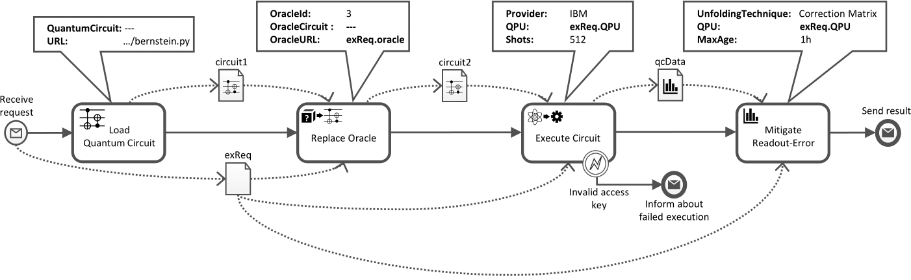
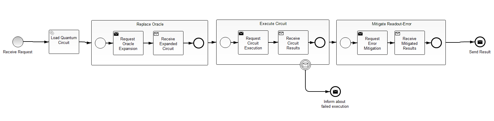

# Bernstein-Vazirani's Algorithm

This project represents a Camunda BPMN 2.0-based business process that executes Bernstein-Vazirani's algorithm to find the hidden bit string that is encoded in a function passed to it by an oracle.

The model presented here is a conversion of the following process model that uses the QuantME extension:



## BPMN 2.0-Compliant Model
The transformed BPMN 2.0 process model (in xml format) can be found [here](src/main/resources/bernstein-algorithm.bpmn).
The model can be visualized and edited using [bpmn.io](https://demo.bpmn.io/), the [Camunda Modeler](https://camunda.com/download/) or the [QuantME Modeling and Transformation Framework](https://github.com/UST-QuAntiL/QuantME-TransformationFramework).

A visualization of the transformed BPMN 2.0-compliant model is presented below (please click on the figure to zoom in):



## Configuring the Process Model

A configuration file is used to specify the following values:

- The endpoint URL of the Camunda Engine (please use your IP address if you run the services using Docker) 
- The endpoint URL of the Oracle Replacement Service
- The endpoint URL of the Circuit Execution Service
- The endpoint URL of the Provenance Service

This configuration file can be found [here](src/main/resources/config.properties). However, if using the Docker-Compose setup on the same host where the Camunda Platform runs, the default configuration can be kept, except using your IP in the Camunda Engine URL, as the Docker Containers can not access it via *localhost*.

## Building the Camunda Project

The project uses Java 8 and can be built and packaged using Maven. Please use the following command to built the WAR file:

```
mvn clean package
```

The project is packaged into a WAR file which can be found in the folloing path:

```
target/bernstein-algorithm-0.0.1-SNAPSHOT.war
```

This WAR file contains the process model as well as the used java classes and their dependencies.

## Deploying the Process Model

Follow these steps to deploy the process model to the Camunda engine:

1. Build and package the project into a WAR file (see above).

2. Install the standalone [Camunda Community Platform](https://camunda.com/download/) (please follow the instructions on this website).
We call the path where you unzipped the Camunda distribution _$CAMUNDA_HOME$_.

3. Camunda has an embedded Apache Tomcat server. Deploy the project you built in step 1 to this server by copying the WAR file
to the following folder:

```
$CAMUNDA_HOME$/server/apache-tomcat-XXX/webapps
```

You can now see the deployed process model in the various Camunda applications (Admin, Tasklist, and Cockpit): 
Go to [the Welcome application](http://localhost:8080/camunda/) and use "demo/demo" as a username and password. 

## Initiating the Process Model

Using the [Tasklist](http://localhost:8080/camunda/app/tasklist/default/#/login) Camunda application, initiate the process 
by logging in (demo/demo) and then clicking on the button "Start process" and finally choosing "Bernstein-Vazirani's Algorithm".

Thereby, three input parameters have to be passed:

- *IBM Access Token*: The access token for IBMs cloud offering [IBM Quantum Experience](https://quantum-computing.ibm.com/) to execute the quantum computation on a real quantum computer.
- *IBMQ QPU Name*: The name of a quantum computer (or simulator) available via [IBM Quantum Experience](https://quantum-computing.ibm.com/). Please have a look at the currently available QPUs and copy the name of one with at least 5 qubits.
- *Oracle URL*: The URL where the oracle that should be used for Bernstein-Vazirani's algorithm is located. Three example oracles can be found [here](circuits). Please have a look at the python files which contain a comment with the expected result. However, any other oracle implementing a function *g : {0,1}<sup>4</sup> --> {0,1}* can be used as the base circuit is intended for 5 qubits, whereby one qubit is required as an ancilla qubit.

After the termination of the calculation, the searched bit string is returned. 

*Notes:* 
- The result as well as errors from other message end events are printed to the console of the Camunda engine. 
Therefore, have a look at this console if the Camunda Cockpit does not display a running instance any more, as the free version does not display terminated instances.
- When executing the first quantum circuit on a certain quantum computer, the provenance service has to build a new calibration matrix. This requires to run lots of calibration circuits, and thus, takes some time. Please have a look in the logs of the services to track the progress.
