# ICWS 2021 Prototype

This use case shows how to model hybrid quantum applications by using workflow technologies to specify the control- and data flow, and provisioning technologies to enable the automatic provisioning of the required execution environment for the hybrid quantum application.
Furthermore, it is demonstrated, how all required artifacts comprising the hybrid quantum application can be packaged in a self-contained manner.

The following figure shows the workflow model implementing our sample hybrid quantum application:


Thereby, the three sub-workflows are represented as collapsed sub-processes, but a visual representation can be accessed [here](./docs/sub-workflows).
Furthermore, the complete workflow model is available in the [BPMN XML representation](./docker/initialized-winery/workflow/src/main/resources/quantum-workflow-demonstrator.bpmn) and can be visualized using the [Camunda Modeler](https://camunda.com/download/modeler/) or the [QuantME Transformation Framework](https://github.com/UST-QuAntiL/QuantME-TransformationFramework), implementing our [workflow modeling extension](https://github.com/UST-QuAntiL/QuantME-Quantum4BPMN) for quantum computing.

In the following, it is presented how a hybrid quantum application can be created, adapted, packaged, and executed.

## Setting up the Hybrid Quantum-Classical Environment

First, we will discuss the steps required to set up the different components realizing the hybrid quantum-classical modeling and runtime environment.
Thereby, all components except the workflow modeling tool (see [Camunda Modeler](https://camunda.com/download/modeler/)) are available via Docker.
However, in this demonstration, we assume that the workflow was already modeled, and thus, it is accessible in [this folder](./docker/initialized-winery/workflow).
Therefore, all required components can be started using the Docker-Compose file available [here](./docker):

1. Update the [.env](./docker/.env) file with your settings: 
  * ``PUBLIC_HOSTNAME``: Enter the hostname/IP address of your Docker engine. Do *not* use ``localhost``.

2. Run the Docker-Compose file:
```
docker-compose pull
docker-compose up --build
```

3. Wait until all containers are up and running. This may take some minutes.

## Modeling and Packaging Hybrid Quantum Applications

Next, it will be shown how the topology of a hybrid quantum application can be modeled and how all required artifacts can be packaged as a quantum application archive (QAA) using [Winery](https://github.com/OpenTOSCA/winery).

For this, open ``$PUBLIC_HOSTNAME:8080`` after all Docker containers have been started successfully to access the Winery:


Thereby, in the ``Service Templates`` tab, two different representations of our sample hybrid quantum application are available:

  * ``OrchestrationsInSuperpositionDemo``:  This Service Template contains a topology where the required virtual machines are automatically provisioned using an OpenStack cloud.
Thus, this is the easiest version to provision the execution environment completely automatically.
However, it requires access to an OpenStack cloud, and if no such cloud is available, the corresponding Node Template in the topology can be replaced by another Node Template, e.g., to provision the virtual machines on AWS.

  * ``OrchestrationsInSuperpositionDemo_RunningVMs``: This Service Template enables the provisioning of the required services and the workflow engine on already running virtual machines.
Therefore, four Ubuntu 20.04 virtual machines have to be provided to use this Service Template.

In the following, we use the ``OrchestrationsInSuperpositionDemo`` Service template, but the other Service Template differs only slightly with respect to the required input parameters.

To visualize the topology of the hybrid quantum application and enable its adaptation, click on the corresponding Service Template.
Afterward, select the ``Topology Template`` tab and click on ``Open Editor`` as shown below. 


Wait until the topology modeler successfully loads the topology and displays it graphically:


In the modeler, the topology can be adapted by dragging and dropping new elements into the canvas, e.g., to add another service or to change the cloud offering that is used to provision the virtual machines.
However, in this example, we will utilize the provided topology without any adaptations.

Switch back to the first tab, where the hybrid quantum application can be exported as a CSAR (implementing a QAA) with all required information to provision the execution environment for the application.
This CSAR can then be transferred as a self-contained package into the target environment.


## Provisioning the Execution Environment

After modeling the workflow and topology of the hybrid quantum application, the corresponding execution environment can be automatically provisioned using the [OpenTOSCA Container](https://github.com/OpenTOSCA/container).

For this, open the user interface available at ``$PUBLIC_HOSTNAME:8088``.
Thereby, it is important to use the IP address and not ``localhost`` to enable a successful deployment.

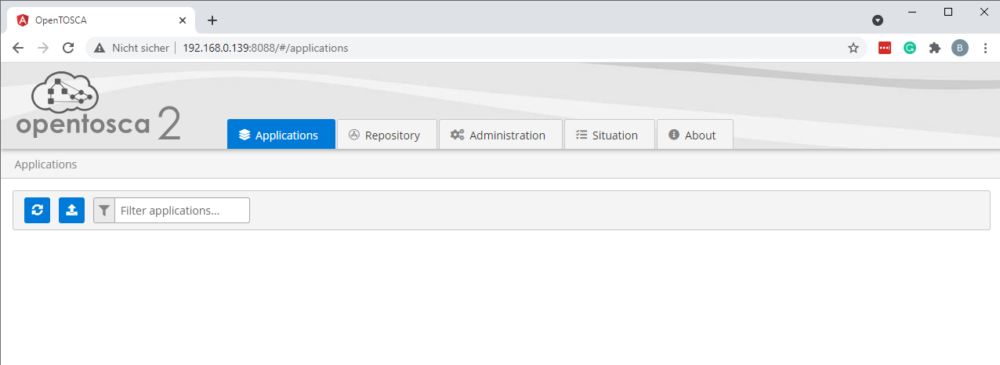

The user interface displays all CSARs that are currently uploaded to the OpenTOSCA container.
Furthermore, it enables uploading CSARs that were previously exported from the Winery (see above).
However, we will directly load the corresponding CSAR from the Winery.
For this, select the ``Repository`` tab, visualizing the CSARs available in the connected Winery.
Select one of the two alternatives discussed above, and click on the plus sign as shown in the following:

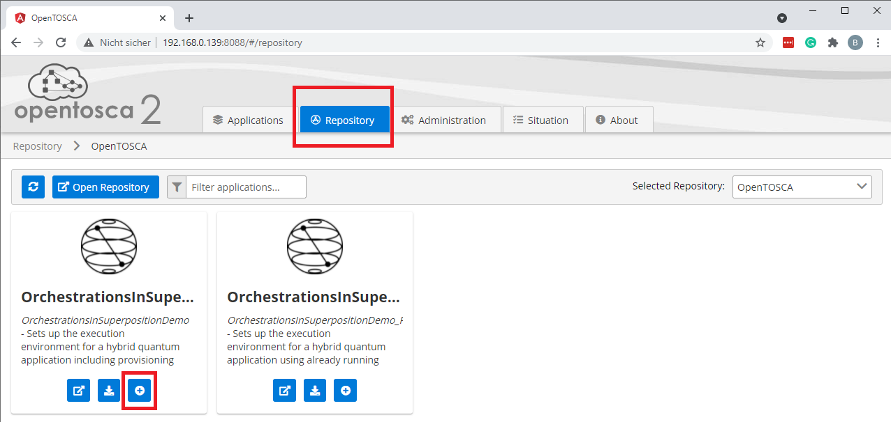

In the pop-up, click on ``install`` and wait until the upload completes and a green arrow is displayed.

Switch back to the ``Applications`` tab, where the uploaded CSAR is shown.
Next, click on the ``Show details...`` button:

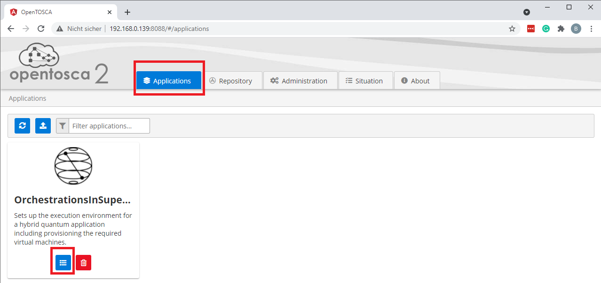

Afterward, an instance of the uploaded CSAR can be provisioned.
For this, click on the plus sign, then select the ``OpenTOSCA-Lifecycle-Interface`` and the ``initiate`` operation.
Finally, click on ``Next`` as depicted in the following figure:

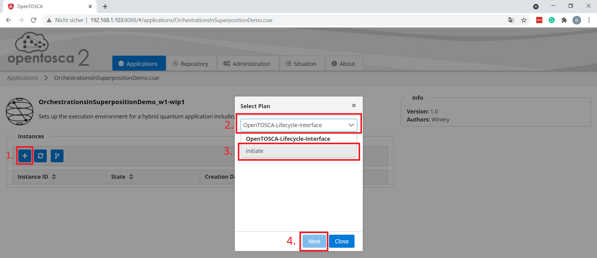

This opens a pop-up requesting the required input parameters for the provisioning:

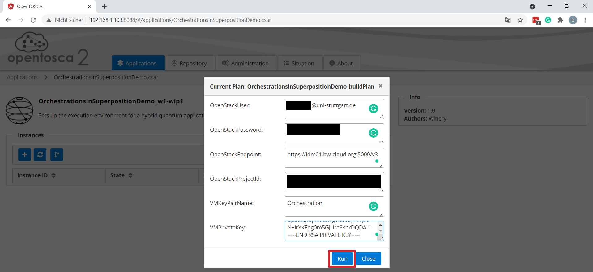

Thereby, the ``OrchestrationsInSuperpositionDemo`` CSAR requires six input parameters:

  * ``OpenStackUser``: The user name to access the OpenStack cloud used to provision the virtual machines.
  * ``OpenStackPassword``: The password corresponding to the OpenStack account.
  * ``OpenStackEndpoint``: The API endpoint of the OpenStack cloud to use.
  * ``OpenStackProjectId``: The project Id of the project under which the virtual machines are created.
  * ``VMKeyPairName``: The name of the key pair that should be used to initialize the virtual machines.
This defines which public key is added to enable later access.
  * ``VMPrivateKey``: The private key corresponding to the defined key pair.

Please note, that the other CSAR requests different input parameters, such as the IP addresses of the virtual machines to use.

By clicking on ``Run``, the provisioning is initiated, which requires several minutes.
During the provisioning the current state can be displayed, by clicking on the ``Show Details``button:

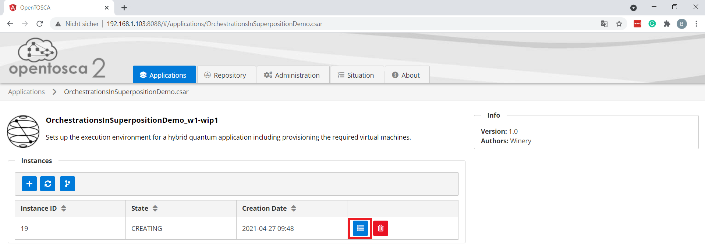

This opens the following page:

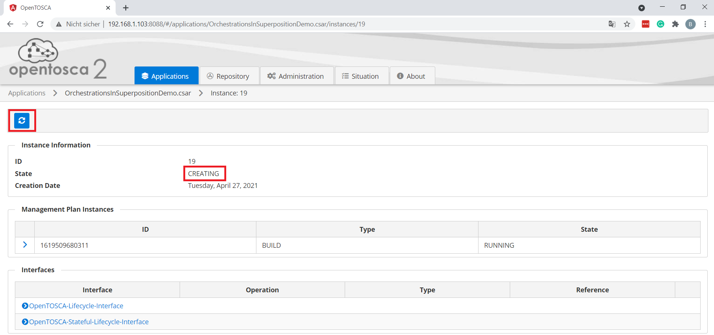

On this page, the current state of the provisioning (``CREATING``) is shown, which can be refreshed by clicking on the corresponding button.
Furthermore, the page also shows the logs of the build plan used to create the instance of the CSAR.
Please wait until the state changes to ``CREATED`` as depicted below:

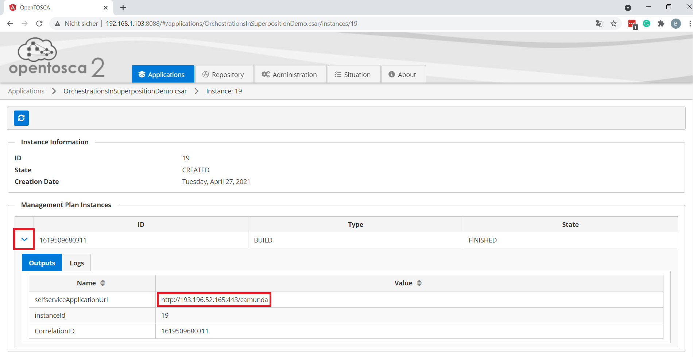

Finally, the endpoint of the deployed Camunda engine with the uploaded workflow of the sample hybrid quantum application can be retrieved.
For this, open the drop-down menu of the build plan instance and extract the endpoint under ``selfserviceApplicationUrl``.

## Execution of the Hybrid Quantum Application

After successfully provisioning the execution environment of the hybrid quantum application, the corresponding workflow can be executed.
Therefore, open the URL of the Camunda engine extracted in the previous step (``http://193.196.52.165:443/camunda`` in the example).
First, create an account in the Camunda engine and log in.
Then, the following screen is displayed:

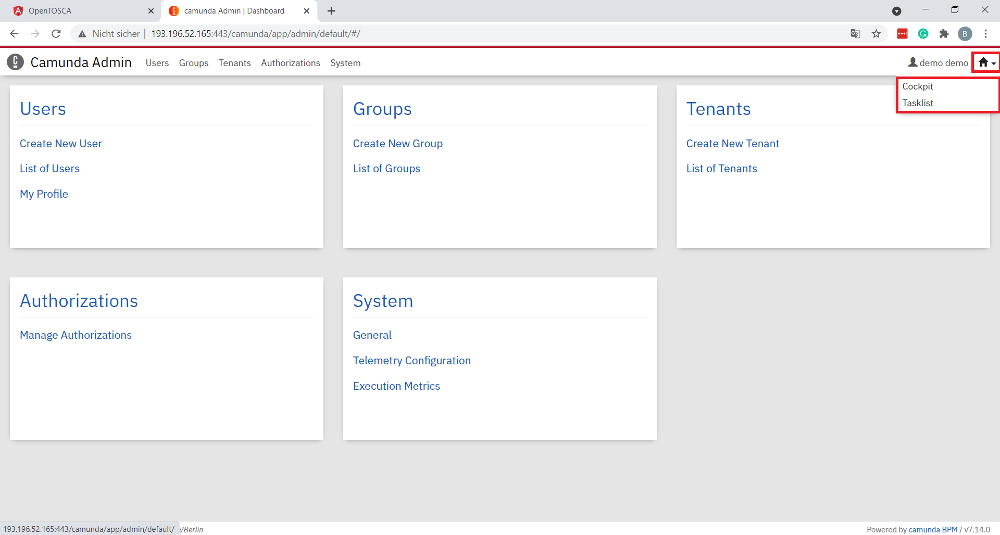

Click on the top-right button and open two tabs with the ``Cockpit`` and ``Tasklist`` applications.
Next, select the tab with the ``Tasklist`` and click on ``Start process`` on the top-right corner.
In the pop-up select ``quantum-workflow-demonstrator``, which results in the following screen:

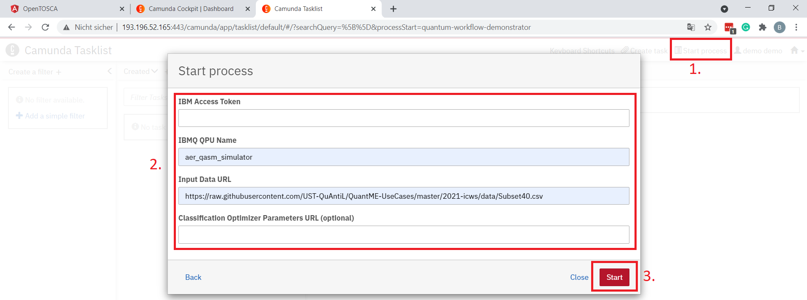

Here, the input parameters for the workflow instance to create are defined.
Thereby, the workflow requests four input parameters:

  * ``IBM Access Token``: The access token from the [IBM Quantum Experience](https://quantum-computing.ibm.com/) to enable executing the quantum circuits using quantum computers or simulators available over the cloud.
  * ``IBMQ QPU Name``: The name of the quantum computer or simulator to use for the execution. 
This can either be the name of a quantum computer or simulator available over IBM Quantum Experience or of a local simulator.
For our example, we use the local simulator available in Qiskit and thus specify ``aer_qasm_simulator``.
Please note, when using the local simulator, no access token is required.
  * ``Input Data URL``: The URL to the input data to use for the data preparation, clustering, and classification steps in the workflow.
For this, we utilize subsets from the [MUSE](https://www.iaas.uni-stuttgart.de/en/projects/muse) repository containing data about costumes.
Thereby, three subsets are available in [this folder](./data) comprising 10, 25, and 40 costumes.
Please make sure to use the URL to the raw content starting with ``https://raw...`` as depicted in the figure.
  * ``Classification Optimizer Parameters URL``: This parameter is optional and enables to customize the optimizer used for the variational quantum support vector machine in the workflow by providing an URL to a corresponding config file.

Finally, click on the ``Start`` button to initiate the workflow.

To monitor the running workflow instance, switch to the ``Cockpit`` tab and click on ``Processes`` at the top-left.
Next, select ``quantum-workflow-demonstrator`` from the list of deployed workflow models.
Then, the workflow and the current position of the token within the workflow, indicating the activity that is currently executed, is visualized as shown below:

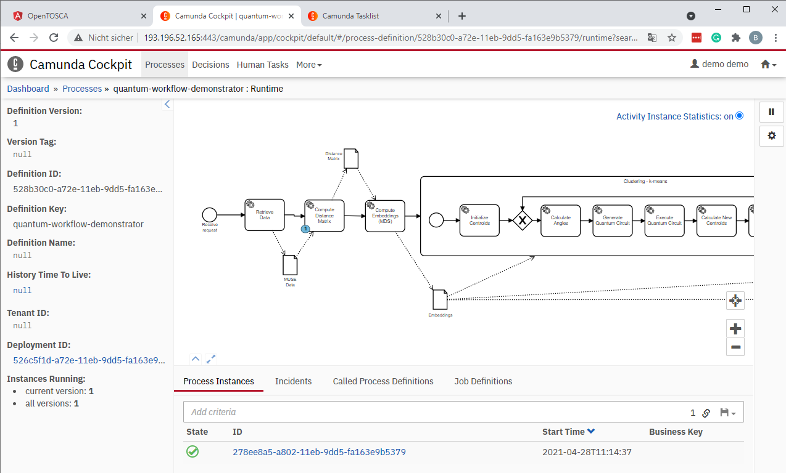

The execution of the workflow takes some time, depending on the size of the used data set.
Refresh the page to track the progress and wait until the token reaches the human task at the end of the workflow.
Afterward, switch back to the ``Tasklist`` tab and ``Add a simple filter`` on the left.
Now, the task object for the human task should be visible in the task list.

TODO

## Troubleshooting

The names of the quantum computers and simulators displayed in [IBM Quantum Experience](https://quantum-computing.ibm.com/) sometimes differ from the names used in Qiskit.
For example, it displays the name `ibmq_5_yorktown - ibmqx2`, but Qiskit uses the name `ibmq_5_yorktown` for this quantum computer.
However, the implementation of the services utilized by the workflow relies on the names used by Qiskit, which has to be passed in the ``IBMQ QPU Name`` input parameter.
Thus, if the execution fails because of an unknown quantum computer, please check the name using Qiskit.

TODO
