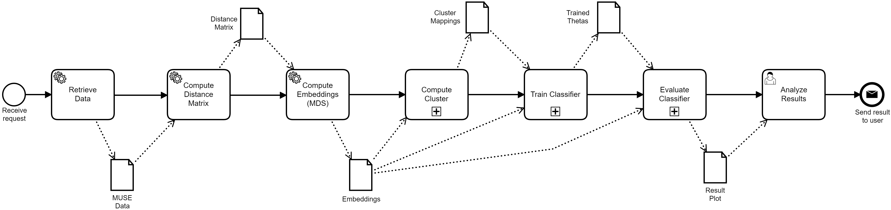
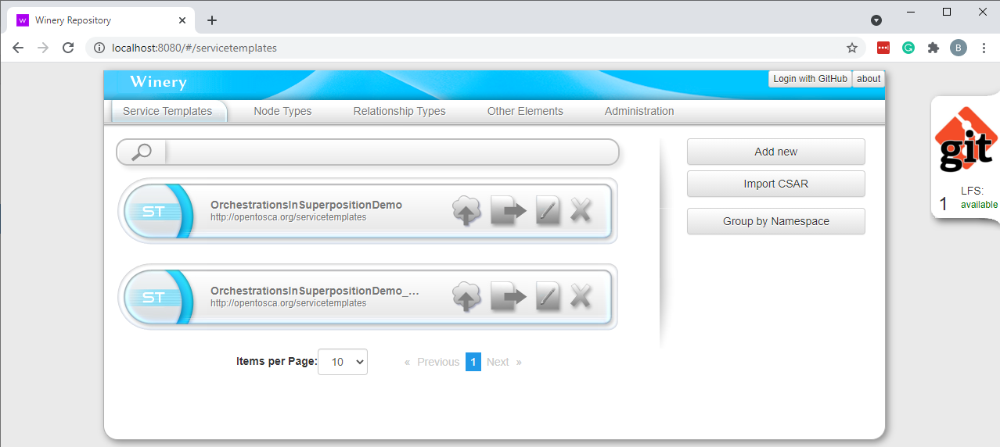
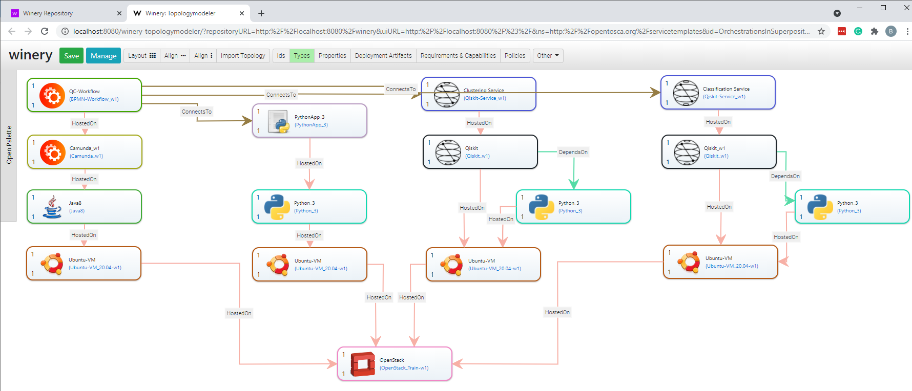
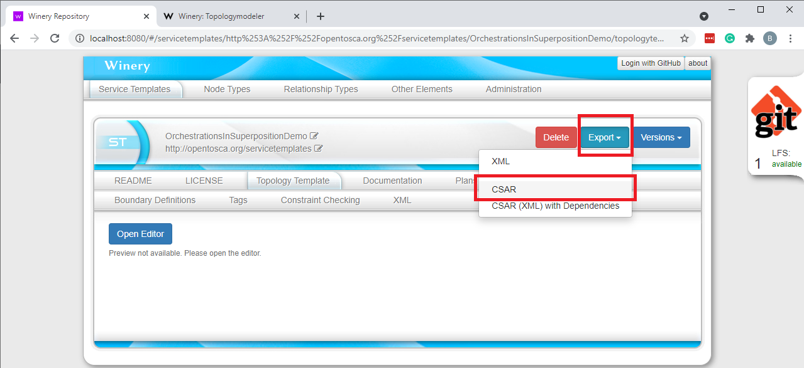

# ICWS 2021 Prototype

This use case shows how to model hybrid quantum applications by using workflow technologies to specify the control- and data flow, and provisioning technologies to enable the automatic provisioning of the required execution environment for the hybrid quantum application.
Furthermore, it is demonstrated, how all required artifacts comprising the hybrid quantum application can be packaged in a self-contained manner.

The following figure shows the workflow model implementing our sample hybrid quantum application:



Thereby, the three sub-workflows are represented as collapsed sub-processes, but a visual representation can be accessed [here](./docs/sub-workflows).
Furthermore, the complete workflow model is available in the [BPMN XML representation](./docker/initialized-winery/workflow/src/main/resources/quantum-workflow-demonstrator.bpmn) and can be visualized using the [Camunda Modeler](https://camunda.com/download/modeler/) or the [QuantME Transformation Framework](https://github.com/UST-QuAntiL/QuantME-TransformationFramework), implementing our [workflow modeling extension](https://github.com/UST-QuAntiL/QuantME-Quantum4BPMN) for quantum computing.

In the following, it is presented how a hybrid quantum application can be created, adapted, packaged, and executed.

## Setting up the Hybrid Quantum-Classical Environment

First, we will discuss the steps required to set up the different components realizing the hybrid quantum-classical modeling and runtime environment.
Thereby, all components except the workflow modeling tool (see [Camunda Modeler](https://camunda.com/download/modeler/)) are available via Docker.
However, in this demonstration, we assume that the workflow was already modeled, and thus, it is accessible in [this folder](./docker/initialized-winery/workflow).
Therefore, all required components can be started using the Docker-Compose file available [here](./docker):

1. Update the [.env](./docker/.env) file with your settings: 
  * ``PUBLIC_HOSTNAME``: Enter the hostname/IP address of your Docker engine. Do *not* use ``localhost``.

2. Run the Docker-Compose file:
```
docker-compose pull
docker-compose up --build
```

3. Wait until all containers are up and running. This may take some minutes.

## Modeling and Packaging Hybrid Quantum Applications

Next, it will be shown how the topology of a hybrid quantum application can be modeled and how all required artifacts can be packaged as a quantum application archive (QAA) using [Winery](https://github.com/OpenTOSCA/winery).

For this, open ``$PUBLIC_HOSTNAME:8080`` after all Docker containers have been started successfully to access the Winery:



Thereby, in the ``Service Templates`` tab, two different representations of our sample hybrid quantum application are available:

  * ``OrchestrationsInSuperpositionDemo``:  This Service Template contains a topology where the required virtual machines are automatically provisioned using an OpenStack cloud.
Thus, this is the easiest version to provision the execution environment completely automatically.
However, it requires access to an OpenStack cloud, and if no such cloud is available, the corresponding Node Template in the topology can be replaced by another Node Template, e.g., to provision the virtual machines on AWS.

  * ``OrchestrationsInSuperpositionDemo_RunningVMs``: This Service Template enables the provisioning of the required services and the workflow engine on already running virtual machines.
Therefore, four Ubuntu 20.04 virtual machines have to be provided to use this Service Template.

In the following, we use the ``OrchestrationsInSuperpositionDemo`` Service template, but the other Service Template differs only slightly with respect to the required input parameters.

To visualize the topology of the hybrid quantum application and enable its adaptation, click on the corresponding Service Template.
Afterward, select the ``Topology Template`` tab and click on ``Open Editor`` as shown below. 


Wait until the topology modeler successfully loads the topology and displays it graphically:



In the modeler, the topology can be adapted by dragging and dropping new elements into the canvas, e.g., to add another service or to change the cloud offering that is used to provision the virtual machines.
However, in this example, we will utilize the provided topology without any adaptations.

Switch back to the first tab, where the hybrid quantum application can be exported as a CSAR (implementing a QAA) with all required information to provision the execution environment for the application.
This CSAR can then be transferred as a self-contained package into the target environment.



## Provisioning the Execution Environment

TODO

## Execution of the Hybrid Quantum Application

TODO

## Troubleshooting

TODO
