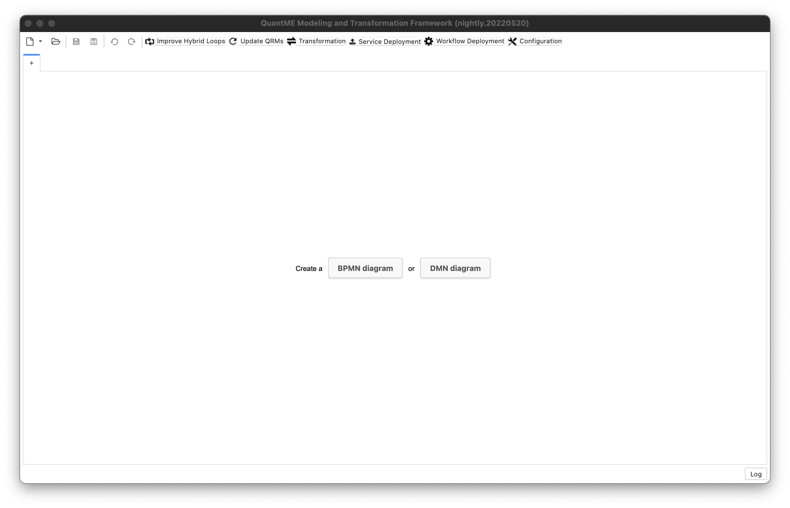
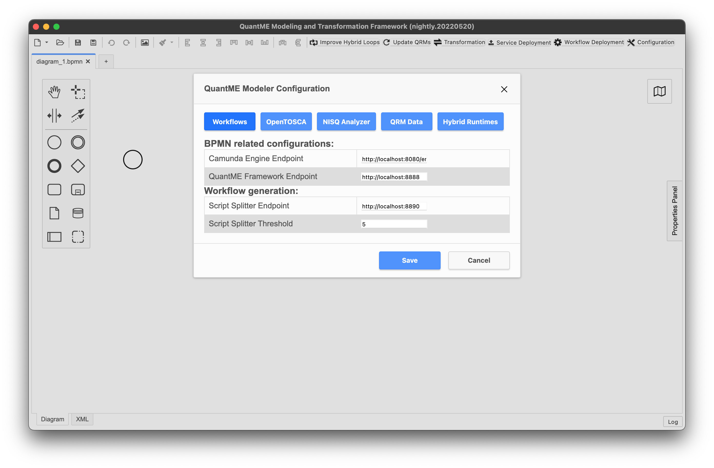
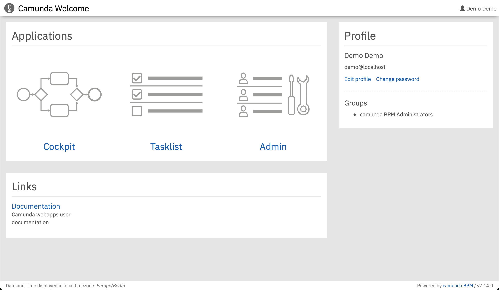
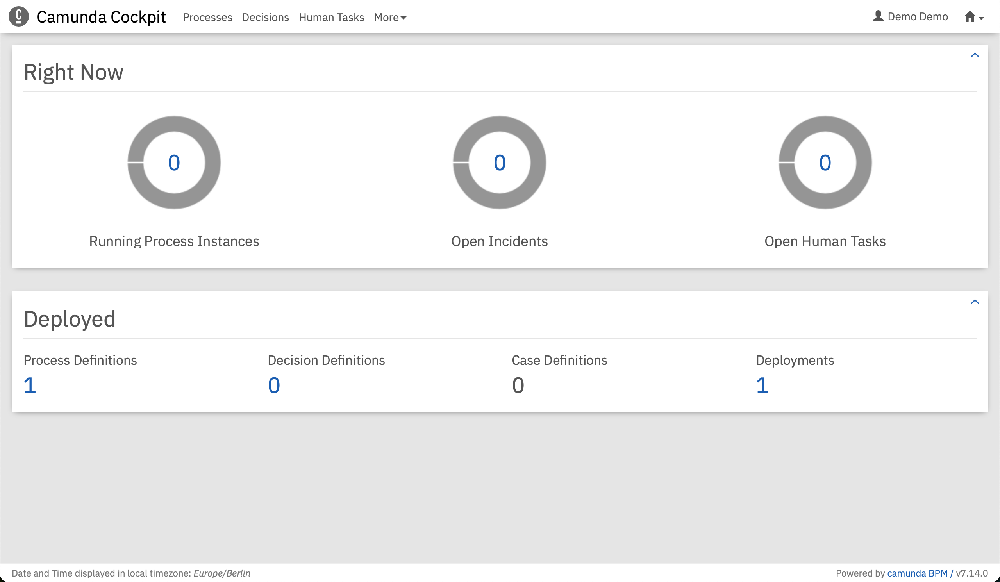
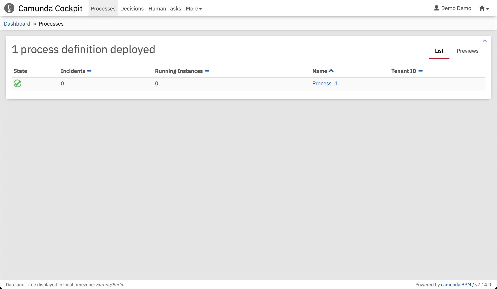
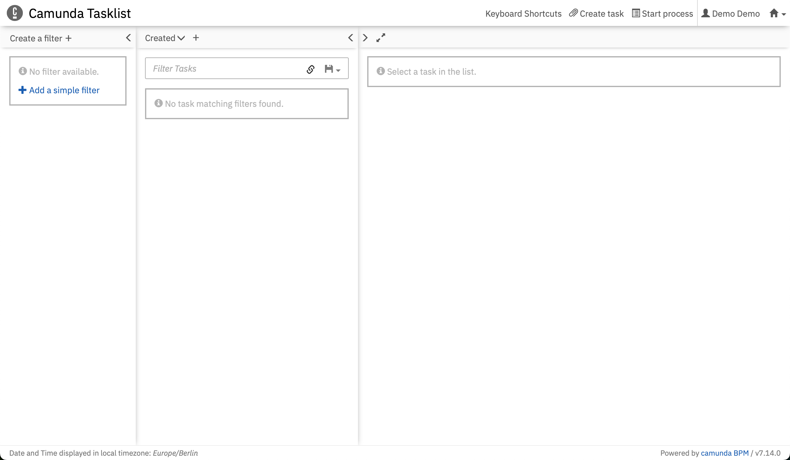
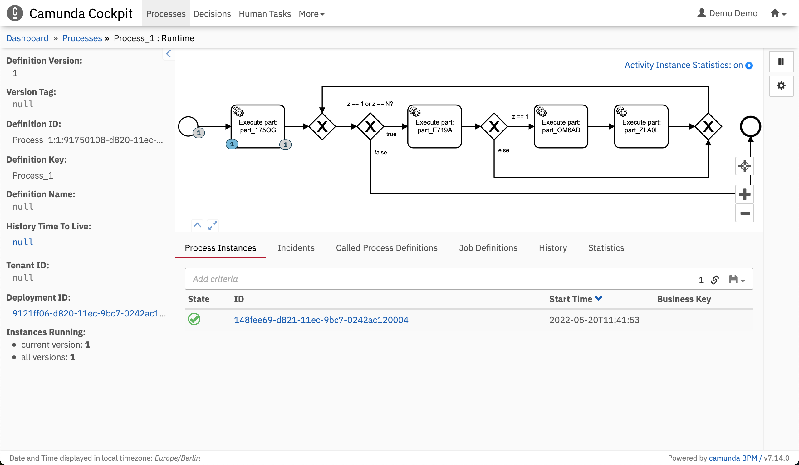

# Script Splitting and Workflow Generation Method

This use case shows how to generate a workflow model from a script-based quantum implementation.

In the following sections, we present the script splitting and workflow generation method based on the implementation in [scripts/shor](scripts/shor) which contains [shor_15.py](scripts/shor/shor_15.py), a Python-based implementation of [Shor's algorithm](https://epubs.siam.org/doi/abs/10.1137/S0036144598347011) and [requirements.txt](scripts/requirements.txt) listing the required packages.


## Setting up the MODULO Framework

First, we will discuss the steps required to set up the different components comprising the MODULO framework.
All components except the [QuantME Transformation Framework](https://github.com/UST-QuAntiL/QuantME-TransformationFramework) providing the graphical BPMN modeler are available via Docker.
Therefore, these components can be started using the Docker-Compose file available [here](./docker):

1. Update the [.env](./docker/.env) file with your settings: 
  * ``PUBLIC_HOSTNAME``: Enter the hostname/IP address of your Docker engine. Do *not* use ``localhost``.

2. Run the Docker-Compose file:
```
docker-compose pull
docker-compose up --build
```

3. Wait until all containers are up and running. This may take some minutes.

To start the QuantME Transformation Framework, please execute the following steps:

1. Clone the repository using release v1.5.1: 
```
git clone https://github.com/UST-QuAntiL/QuantME-TransformationFramework.git --branch v1.5.1
```

2. Move to the cloned folder and build the framework:
```
npm install
npm run build
```

3. The build product can be found in the ``dist`` folder and started depending on the operating system, e.g., using the ``.exe`` for Windows.

Afterwards, the following screen should be displayed:




The QuantME Transformation Framework must be configured with the endpoints of the services for the deployment and the hybrid program generation.
For this, click on ``BPMN Diagram`` first and then click on ``Configuration`` in the toolbar, opening the config pop-up:



Please update the different configuration properties using the following values. 
Thereby, $IP has to be replaced with the IP-address of the Docker engine used for the setup described above:

| Workflows                 |                                 | 
| :---                      | :---                            |
| Camunda Engine Endpoint   | ``http://$IP:8080/engine-rest`` |
| Script Splitter Endpoint  | ``http://$IP:8090``             |
| Script Splitter Threshold | ``3``                           |

| OpenTOSCA                 |                                 |
| :---                      | :---                            | 
| OpenTOSCA Endpoint        | ``http://$IP:1337/csars``       |
| Winery Endpoint           | ``http://$IP:8093/winery``      |


## Script Splitting and Workflow Generation

The workflow generation expects a zip file including the Python script as well as a requirements file as input.
Thus, zip the two files, e.g., using the following command:
```zip script.zip scripts/shor_sim15.py scripts/requirements.txt```
Next, click on ``File`` in the top-left corner, and select ``Generate Workflow...``.
A file selection handler pops up.
Select the zip file containing ``shor_15.py`` and ``requirements.txt``.
The script splitting and workflow generation is now in process.
Wait until it is finished; the generated workflow models opens automatically in the Modeler.


## Deploying the Required Services

Next, the required services for the workflow execution can be deployed.
For this, click on the ``Service Deployment`` button in the toolbar:


The pop-up lists the IDs of all service tasks to which deployment models are attached, the name of the CSAR representing the deployment model, and the binding type of the service to deploy.
All required services are deployed using the [OpenTOSCA Container](https://github.com/OpenTOSCA/container), a TOSCA-compliant deployment system.
To trigger the upload of the CSARs to the OpenTOSCA Container, press the ``Upload CSARs`` button.
The OpenTOSCA Container automatically generates a deployment plan for the different services, and analyzes if additional input data has to be requested from the user.
Once the upload is finished, the required input parameters are displayed on the following screen:


All services for this use case are deployed as Docker containers in a local [Docker-in-Docker (dind)](https://github.com/jpetazzo/dind) container.
Thus, no additional input parameters are required for these services.
After adding the token, click on the ``Deploy Services`` button, and wait until the deployment finishes. Afterwards, the screen below is shown:


In the last step of the service deployment, the newly created service instances are bound to the workflow.
For this, click on the ``Perform Binding`` button.

Finally, the workflow model can be deployed to the [Camunda BPMN engine](https://camunda.com/products/camunda-platform/bpmn-engine/), by clicking on the ``Workflow Deployment`` button in the toolbar:


## Executing the Quantum Workflow

After successfully deploying all required services and the workflow model, open the URL of the Camunda BPMN engine: ``$PUBLIC_HOSTNAME:8080/camunda``

First, create an account in the Camunda engine and log in. 
Then, the following screen is displayed:



Switch to the Camunda cockpit application by clicking on the top-right and selecting ``Cockpit``:



If the workflow model was successfully deployed in the [deployment step](#deploying-the-required-services), a 1 should be displayed under the ``Process Definitions`` label. 
Click on ``Processes`` on the top to get a list of all deployed workflow models:



Select the previously modeled and deployed workflow model by clicking on its name, which opens a view where the workflow model is shown. 
In this view, the token flow can be observed during workflow execution, i.e., it is visualized which activity of the workflow model is currently executed. 
Furthermore, the current values of the different variables in the workflow are displayed. 
To execute the workflow, open another tab with the Camunda tasklist application by clicking on the top-right and selecting ``Tasklist``:



To instantiate the workflow model, select ``Start process`` on the top-right and click on the name of the workflow in the pop-up menu. 


Next, click on ``Start``.
The UI displays a notification at the bottom-right that the workflow instance was successfully started.
Switch back to the Camunda cockpit application to observe the token flow in the workflow:



Click on the corresponding workflow instance at the bottom, to view more details, such as the current values of the variables:


To terminate the environment, execute the following command in the [folder](./docker) with the Docker-Compose file: ``docker-compose down -v``
