# Electronics 2022 Prototype

In this use-case, we show how to automate the configuration of Readout Error Mitigation (REM) methods using QuantME.
REM is employed to mitigate measurement errors for all quantum circuit executions, improving the quality of the obtained solution.
In the following, we will show how to integrate REM in a comprehensible and time-efficient manner into quantum workflows.


In the following sections, we present the analysis and rewrite method based on the workflow model shown below:

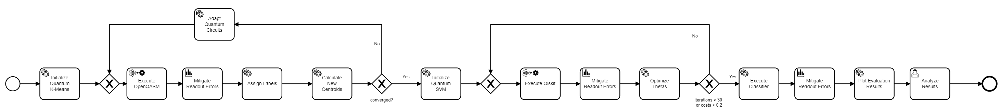


First, [pre-processed data](./data/embedding.txt) is loaded, which is used to initialize a quantum k-means algorithm.
Then, the workflow enters a hybrid loop, executing quantum circuits, calculating new centroids based on the results, and adapting the quantum circuits if needed for the next iteration.
This loop ends when the clustering converges, i.e., the difference between the new and old centroids is smaller than a given threshold or the maximum number of iterations is reached.
Next, a variational support vector machine is trained.
This is done using another hybrid loop, optimizing the parameters theta until the incurred costs are smaller than 0.2 or the limit of 30 iterations is reached.
Finally, the variational support vector machine is evaluated by classifying test data, and the resulting figure is displayed to the user in the last user task.
After all quantum circuit execution tasks, REM is performed.

In case you experience any problems during modeling, deployment, or execution of the workflow, please refer to the [Troubleshooting](#troubleshooting) section at the end of this README.

## Setting up the MODULO Framework

First, we will discuss the steps required to set up the different components comprising the MODULO framework.
All components except the [QuantME Transformation Framework](https://github.com/UST-QuAntiL/QuantME-TransformationFramework) providing the graphical BPMN modeler are available via Docker.
Therefore, these components can be started using the Docker-Compose file available [here](./docker):

1. Update the [.env](./docker/.env) file with your settings: 
  * ``PUBLIC_HOSTNAME``: Enter the hostname/IP address of your Docker engine. Do *not* use ``localhost``.

2. Run the Docker-Compose file:
```
docker-compose pull
docker-compose up --build
```

3. Wait until all containers are up and running. This may take some minutes.

To start the QuantME Transformation Framework, please execute the following steps:

1. Clone the repository using release v1.7.0:  
```
git clone https://github.com/UST-QuAntiL/QuantME-TransformationFramework.git --branch v1.7.0
```

2. Move to the cloned folder and build the framework:
```
npm install
npm run build
```

3. The build product can be found in the ``dist`` folder and started depending on the operating system, e.g., using the ``.exe`` for Windows.

Afterwards, the following screen should be displayed:


Open the example workflow model available [here](./workflow/error-mitigation-example-workflow.bpmn) using the QuantME Transformation Framework.
For this, click on ``File`` in the top-left corner, and afterwards, select the workflow model in the dialogue ``Open File...``.
Then, the following screen is displayed:

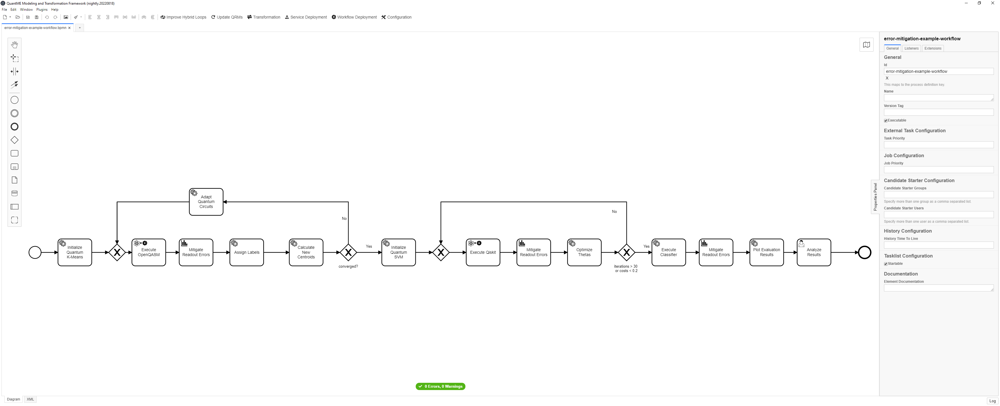

The QuantME Transformation Framework must be configured with the endpoints of the services for the deployment and the hybrid program generation.
For this, click on ``Configuration`` in the toolbar, opening the config pop-up:

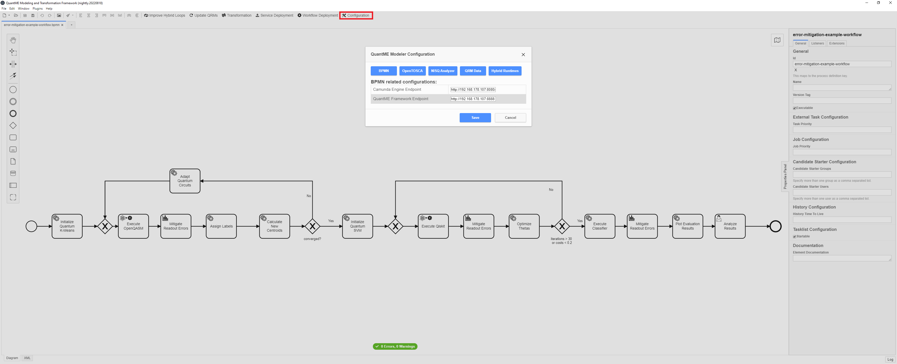

Please update the different configuration properties using the following values. 
Thereby, $IP has to be replaced with the IP-address of the Docker engine used for the setup described above:

* ``BPMN`` tab:
    * ``Camunda Engine Endpoint``: http://$IP:8080/engine-rest
* ``OpenTOSCA`` tab:
    * ``OpenTOSCA Endpoint``: http://$IP:1337/csars
    * ``Winery Endpoint``: http://$IP:8093/winery
* ``QRM Data`` tab:
    * ``QRM Repository User``: UST-QuAntiL
    * ``QRM Repository Name``: QuantME-UseCases
    * ``QRM Repository Path``: 2022-electronics/qrms


## Modeling the Workflow and Transform it to Native BPMN

The tasks of the loaded workflow can now be configured via the workflow modeler's property window, e.g,. selecting a REM method.
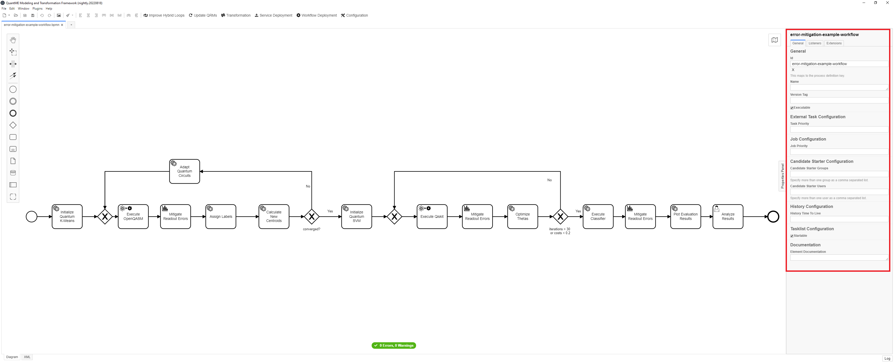

Once the workflow is configured it needs to be transformed into native BPMN.
To trigger the transformation click the ``Transformation`` button.

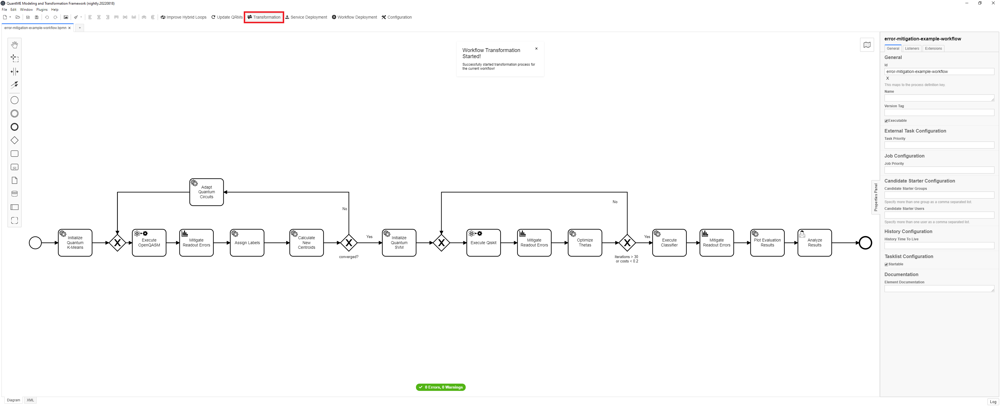

As a result the transformed workflow model will be shown.
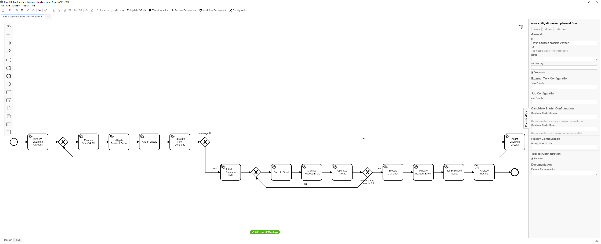


## Deploying the Required Services

Next, the required services for the workflow execution can be deployed.
For this, click on the ``Service Deployment`` button in the toolbar:


The pop-up lists the IDs of all service tasks to which deployment models are attached, the name of the CSAR representing the deployment model, and the binding type of the service to deploy.
All required services are deployed using the [OpenTOSCA Container](https://github.com/OpenTOSCA/container), a TOSCA-compliant deployment system.
To trigger the upload of the CSARs to the OpenTOSCA Container, press the ``Upload CSARs`` button.
The OpenTOSCA Container automatically generates a deployment plan for the different services, and analyzes if additional input data has to be requested from the user.
Once the upload is finished, the required input parameters are displayed on the following screen:

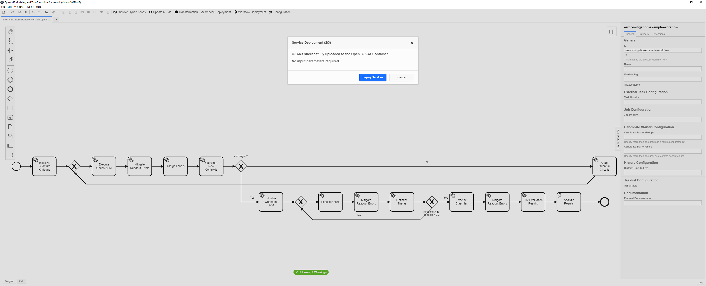

All services for this use case are deployed as Docker containers in a local [Docker-in-Docker (dind)](https://github.com/jpetazzo/dind) container.
Thus, no additional input parameters are required for these services.
Next, click on the ``Deploy Services`` button, and wait until the deployment finishes. Afterwards, the screen below is shown:

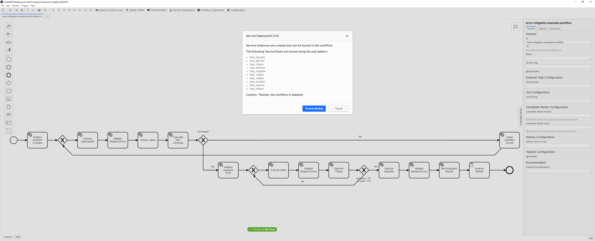

In the last step of the service deployment, the newly created service instances are bound to the workflow.
For this, click on the ``Perform Binding`` button.

Finally, the workflow model can be deployed to the [Camunda BPMN engine](https://camunda.com/products/camunda-platform/bpmn-engine/), by clicking on the ``Workflow Deployment`` button in the toolbar:

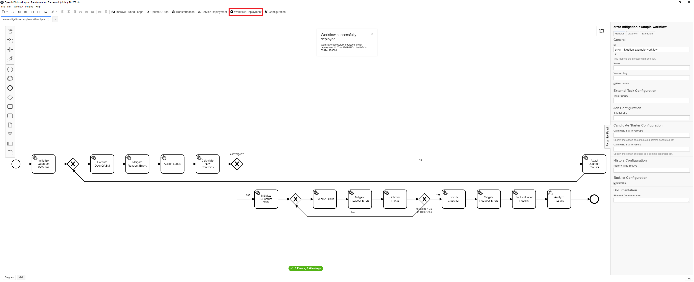

## Executing the Quantum Workflow

After successfully deploying all required services and the workflow model, open the URL of the Camunda BPMN engine: ``$PUBLIC_HOSTNAME:8080/camunda``

First, create an account in the Camunda engine and log in. 
Then, the following screen is displayed:

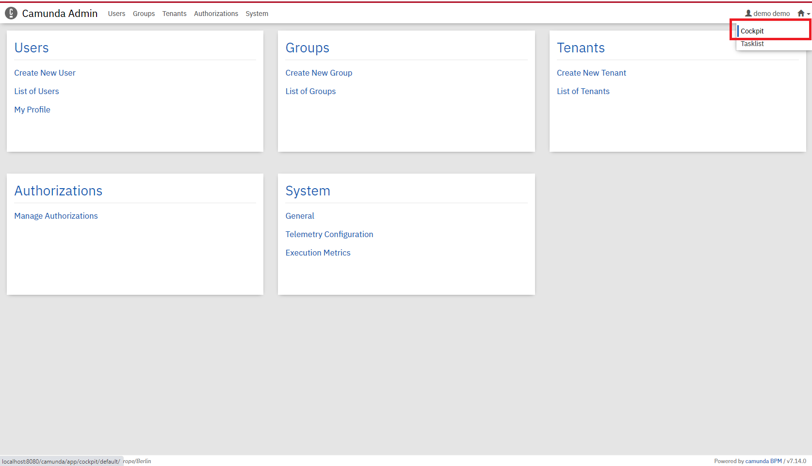

Switch to the Camunda cockpit application by clicking on the top-right and selecting ``Cockpit``:

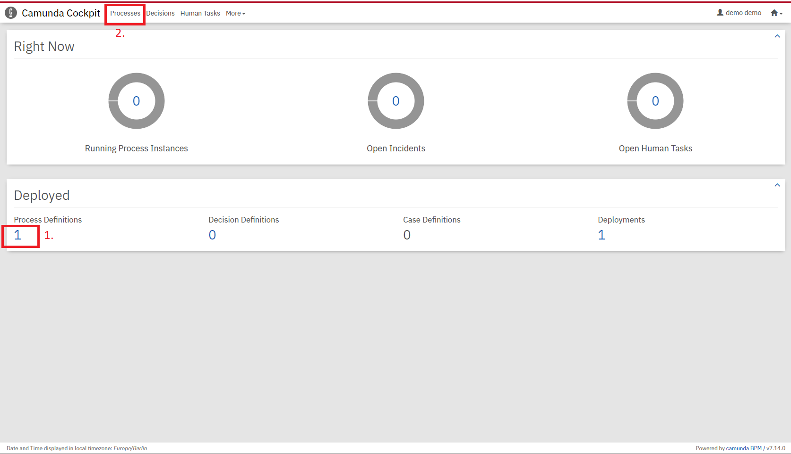

If the workflow model was successfully deployed in the [deployment step](#deploying-the-required-services), a 1 should be displayed under the ``Process Definitions`` label. 
Click on ``Processes`` on the top to get a list of all deployed workflow models:

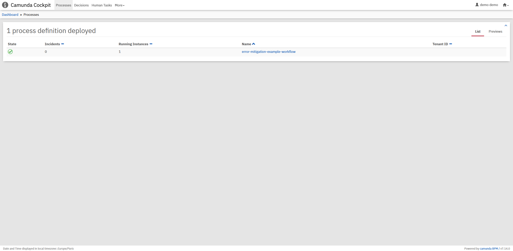

Select the previously modeled and deployed workflow model by clicking on its name, which opens a view where the workflow model is shown. 
In this view, the token flow can be observed during workflow execution, i.e., it is visualized which activity of the workflow model is currently executed. 
Furthermore, the current values of the different variables in the workflow are displayed. 
To execute the workflow, open another tab with the Camunda tasklist application by clicking on the top-right and selecting ``Tasklist``:

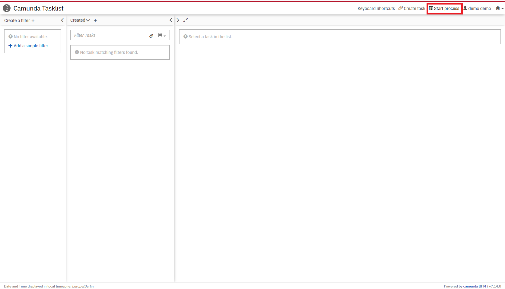

To instantiate the workflow model, select ``Start process`` on the top-right and click on the name of the workflow in the pop-up menu. 
Next, the required input parameters for the instantiation are shown, which were defined in the start event form of the workflow:

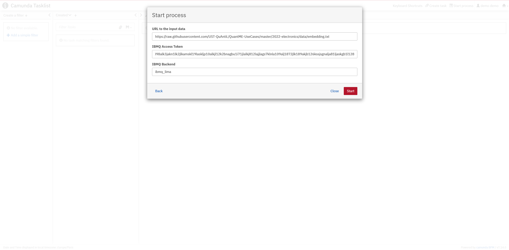

Provide your IBMQ access token, as well as one of the QPUs available over IBMQ (``ibmq_lima`` in the example) as input parameters.
Furthermore, the URL to the input data has to be passed as a parameter.
Thereby, the [pre-processed data](./data/embedding.txt) is available in this repository, and thus, the following URL can be used: ``https://raw.githubusercontent.com/UST-QuAntiL/QuantME-UseCases/master/2022-electronics/data/embedding.txt``

After entering the input parameters, click on ``Start``.
The UI displays a notification at the bottom-right that the workflow instance was successfully started.
Switch back to the Camunda cockpit application to observe the token flow in the workflow:

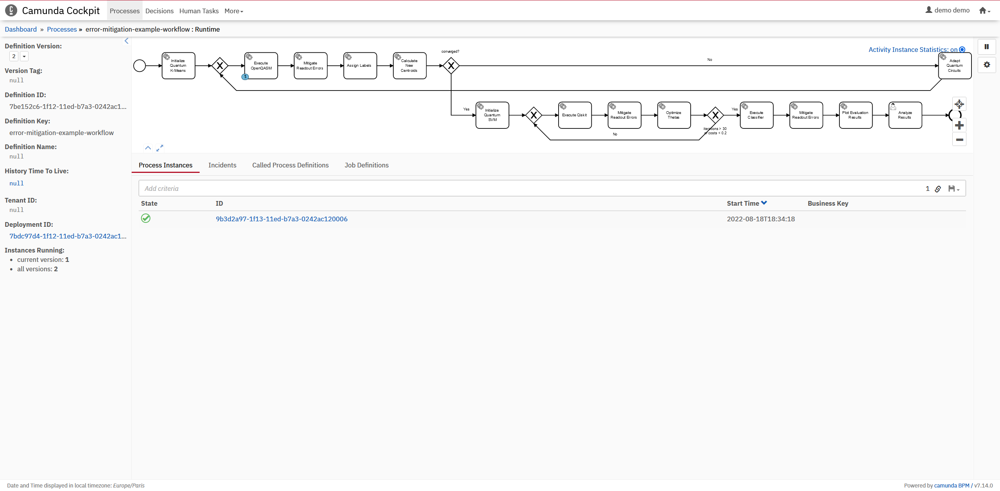

Click on the corresponding workflow instance at the bottom, to view more details, such as the current values of the variables:


Wait until the token reaches the final user task in the workflow as depicted below.
For this, refresh the page to see the current state of the workflow instance.
This might take some time, depending on the utilization of the selected QPU.

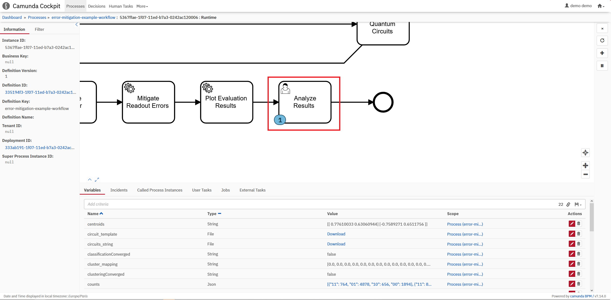

Afterward, switch to the Camunda tasklist and click on ``Add a simple filter`` on the left.
Now, the task object for the human task should be visible in the task list.
Click on the task object and then on the ``Claim`` button to get the URL for the plot of the boundary definition resulting from the evaluation of the trained classifier:

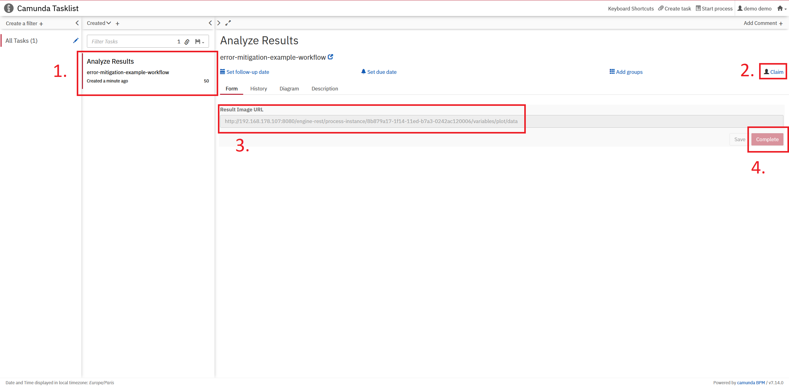

After analyzing the result, click on the ``Complete`` button to finish the human task, and as it is the last activity in the workflow to terminate the workflow instance.

To terminate the environment, execute the following command in the [folder](./docker) with the Docker-Compose file: ``docker-compose down -v``

## Troubleshooting

The setup starts overall 16 Docker containers, and the required services are deployed within one of these containers using so-called [Docker-in-Docker (dind)](https://github.com/jpetazzo/dind).
Thus, if the startup of the Docker-Compose file or the deployment of the services fails, please make sure to provide enough resources to the docker engine, i.e., CPU, main memory, and disk space.
