# Springer Nature Computer Science 2022 Prototype

Different hybrid quantum algorithms require the interleaved execution of quantum and classical programs in a hybrid loop, e.g., the [Quantum Approximate Optimization Algorithm (QAOA)](https://arxiv.org/abs/1411.4028) or the [Variational Quantum Eigensolver (VQE)](https://www.nature.com/articles/nature23879?sf114016447=1).
For these algorithms, the orchestration using workflows can be ineffiecient due to queing and data transmission times summing up over multiple iterations.
Thus, so-called *hybrid runtimes*, such as the [Qiskit Runtime](https://quantum-computing.ibm.com/lab/docs/iql/runtime/) or [AWS Braket Hybrid Jobs](https://docs.aws.amazon.com/braket/latest/developerguide/braket-jobs.html), were developed hosting the quantum and classical programs for such algorithms and optimizing their execution.
In this use case, we show how to model quantum workflows independently of a certain hybrid runtime, analyze them to find workflow fragments that can benefit from hybrid runtimes, and rewrite the workflow to use these runtimes instead of orchestrating the hybrid loops.
However, rewriting the workflow leads to a difficult monitoring and analysis of workflow executions, as the modeled and executed workflows differ.
Hence, process views are utilized to visualize the modeled and executed workflow within the workflow engine depending on the user needs.

Furthermore, also a demo video showing the different steps of this tutorial is available on [YouTube](TODO).

In the following sections, we present the analysis and rewrite method based on the workflow model shown below:

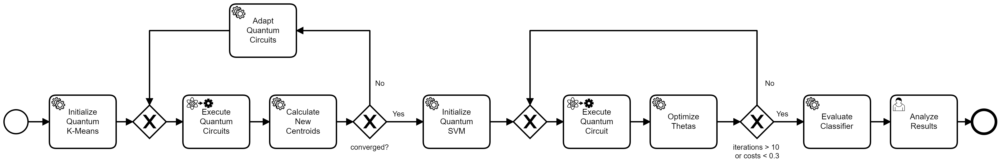

First, [pre-processed data](./data/embedding-10.txt) is loaded, which is used to initialize a quantum k-means algorithm.
Then, the workflow enters a hybrid loop, executing quantum circuits, calculating new centroids based on the results, and adapting the quantum circuits if needed for the next iteration.
This loop ends when the clustering converges, i.e., the difference between the new and old centroids is smaller than a given threshold or the maximum number of iterations is reached.
Next, a variational support vector machine is trained.
This is done using another hybrid loop, optimizing the parameters theta until the incurred costs are smaller than 0.3 or the limit of 10 iterations is reached.
Finally, the variational support vector machine is evaluated by classifying test data, and the resulting figure is displayed to the user in the last user task.

In case you experience any problems during modeling, rewrite, deployment, or execution of the workflow, please refer to the [Troubleshooting](#troubleshooting) section at the end of this README.

The use case utilizes the MODULO framework, comprising the following components, for which more details can be found in their corresponding Github repositories:

* [QuantME Modeling and Transformation Framework](https://github.com/UST-QuAntiL/QuantME-TransformationFramework): A graphical BPMN modeler to define quantum workflows, as well as analyzing and rewriting them for the usage of hybrid runtimes.
* [Camunda Process View Plugin](https://github.com/UST-QuAntiL/camunda-process-views-plugin): A plugin for the [Camunda engine](https://camunda.com/platform-7/workflow-engine) enabling to visualize process views for quantum workflows.
* [Qiskit Runtime Handler](https://github.com/UST-QuAntiL/qiskit-runtime-handler): A handler generating Qiskit Runtime programs based on a given workflow fragments orchestrating a hybrid loop.
* [Winery](https://github.com/OpenTOSCA/winery): A graphical modeler for TOSCA-based deployment models.
* [OpenTOSCA Container](https://github.com/OpenTOSCA/container): A standard-compliant deployment system for TOSCA-based deployment models.

## Setting up the MODULO Framework

First, we will discuss the steps required to set up the different components of the MODULO framework.
All components except the QuantME Modeling and Transformation Framework, providing the graphical BPMN modeler, are available via Docker.
Therefore, these components can be started using the Docker-Compose file available [here](./docker):

1. Update the [.env](./docker/.env) file with your settings: 
  * ``PUBLIC_HOSTNAME``: Enter the hostname/IP address of your Docker engine. Do *not* use ``localhost``.

2. Run the Docker-Compose file:
```
docker-compose pull
docker-compose up --build
```

3. Wait until all containers are up and running. This may take some minutes.

To start the QuantME Modeling and Transformation Framework, please execute the following steps:

1. Clone the repository using release v1.6.0: 
```
git clone https://github.com/UST-QuAntiL/QuantME-TransformationFramework.git --branch v1.6.0
```

2. Move to the cloned folder and build the framework:
```
npm install
npm run build
```

3. The build product can be found in the ``dist`` folder and started depending on the operating system, e.g., using the ``.exe`` for Windows.

Afterwards, the following screen should be displayed:

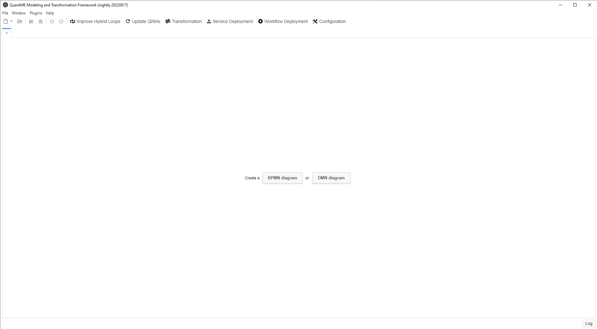

Open the example workflow model available [here](./workflow/analysis-and-rewrite-workflow.bpmn) using the QuantME Modeling and Transformation Framework.
For this, click on ``File`` in the top-left corner, and afterwards, select the workflow model in the dialogue ``Open File...``.
Then, the following screen is displayed:


The QuantME Modeling and Transformation Framework must be configured with the endpoints of the services for the deployment and the hybrid program generation.
For this, click on ``Configuration`` in the toolbar, opening the config pop-up:

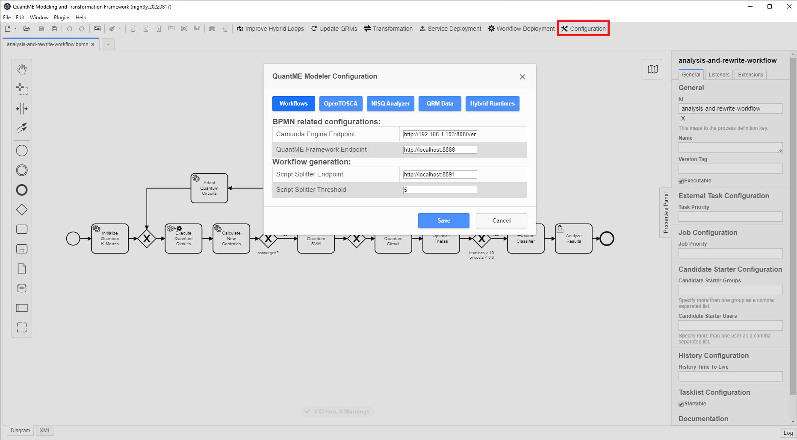

Please update the different configuration properties using the following values.
Thereby, $IP has to be replaced with the IP-address of the Docker engine used for the setup described above:

* ``BPMN`` tab:
    * ``Camunda Engine Endpoint``: http://$IP:8080/engine-rest
* ``OpenTOSCA`` tab:
    * ``OpenTOSCA Endpoint``: http://$IP:1337/csars
    * ``Winery Endpoint``: http://$IP:8093/winery
* ``QRM Data`` tab:
    * ``QRM Repository User``: UST-QuAntiL
    * ``QRM Repository Name``: QuantME-UseCases
    * ``QRM Repository Path``: 2022-sncs/qrms
* ``Hybrid Runtimes`` tab:
    * ``Qiskit Runtime Handler Endpoint``: http://$IP:8889
    * ``Retrieve Intermediate Results``: Tick the checkbox

In case you want to execute the workflow model without optimization, press the ``Transformation`` Button in the toolbar on the top to retrieve a standard-compliant BPMN workflow model.
Then, directly go to the [Deploying the Required Services](#deploying-the-required-services) section.
However, do *not* perform the transformation if you want to optimize the workflow, as this has to be done before the transformation step.

## Analysis and Rewrite of Quantum Workflows

To trigger the workflow analysis and rewrite, click on the ``Improve Hybrid Loops`` button on the top.
Then, the following modal is displayed, comprising some information about the analysis and rewrite method:

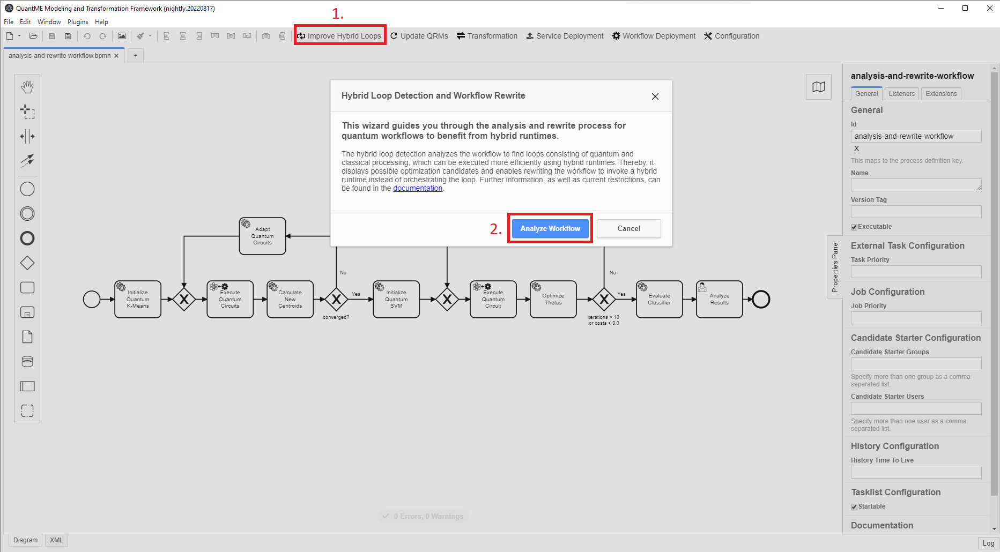

Press the ``Analyze Workflow`` button to start the detection of hybrid loops within the workflow, which could benefit from a hybrid runtime.
When the analysis finishes, the possible optimization candidates are visualized in the next modal:

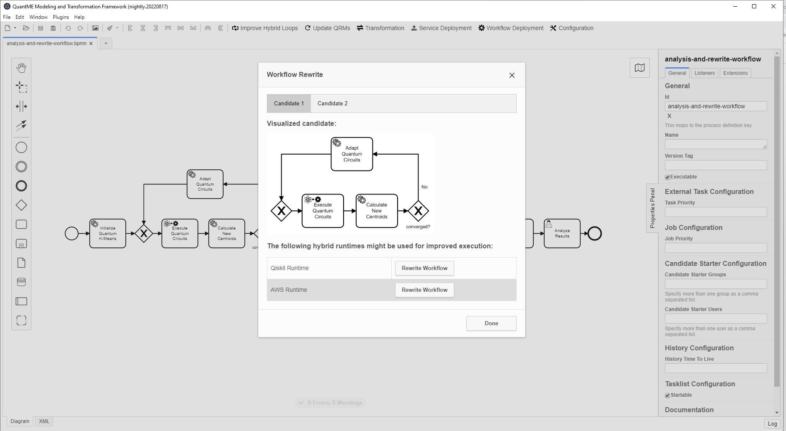

In our example workflow, two optimization candidates are detected, one performing the clustering, and the second comprising the classification tasks.
The tabs on the top of the modal can be used to switch between the visualization of all detected optimization candidates:

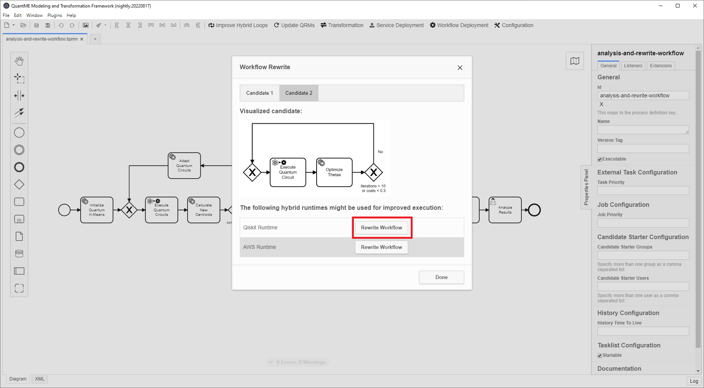

Furthermore, a list of supported hybrid runtimes is displayed in the table below.
Currently, Qiskit Runtime and AWS Braket Hybrid Jobs are supported.
As the quantum programs for this use case are implemented using Qiskit, we utilize the Qiskit Runtime in this example.
Click on the ``Rewrite Workflow`` button to analyze if the selected hybrid runtime supports the current candidate.
If yes, a hybrid program, as well as a corresponding deployment model, are automatically generated for the candidate.
Finally, the workflow is rewritten to invoke the generated hybrid program.
After clicking on the button, the following screen is displayed until the analysis and rewrite terminates, which might take some time:

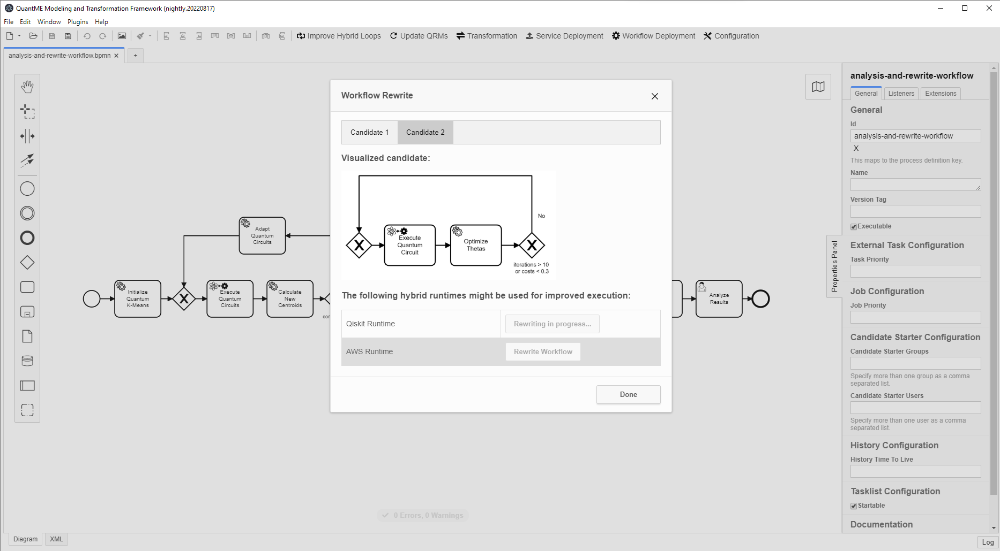

If the rewriting is successful, the color of the button is changed to green and the workflow is adapted in the background, as shown in the next figure:

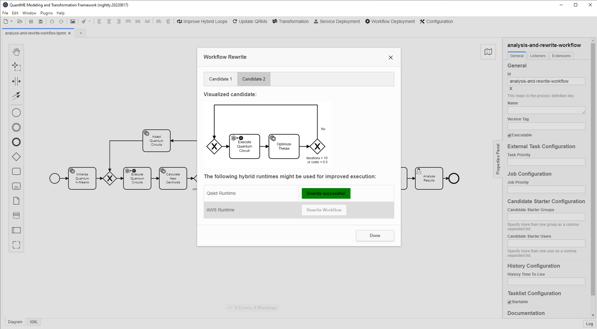

Start the rewriting also for the other candidate, and wait until it completes.
Then, close the modal, which shows the rewritten workflow model within the modeler:

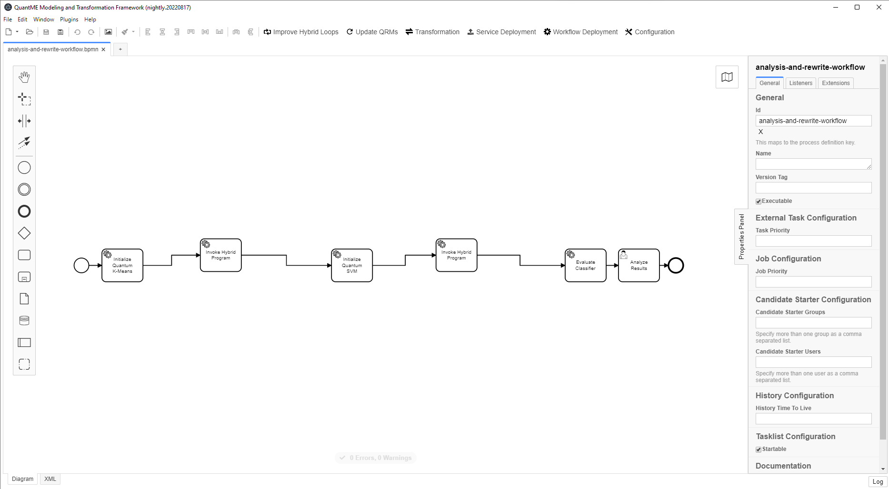

The resulting workflow contains five service tasks.
Thereby, three service tasks were not part of an optimization candidate and are unchanged.
In contrast, all remaining tasks contained in the hybrid loops are replaced by two new service tasks invoking the corresponding hybrid programs.

## Deploying the Required Services

Next, the required services for the workflow execution can be deployed.
For this, click on the ``Service Deployment`` button in the toolbar:

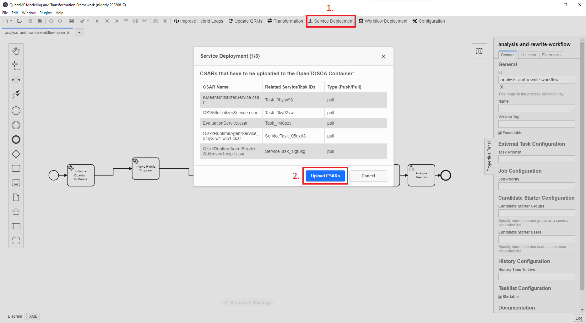

The pop-up lists the IDs of all service tasks to which deployment models are attached, the name of the CSAR representing the deployment model, and the binding type of the service to deploy.
All required services are deployed using the OpenTOSCA Container, a TOSCA-compliant deployment system.
To trigger the upload of the CSARs to the OpenTOSCA Container, press the ``Upload CSARs`` button.
The OpenTOSCA Container automatically generates a deployment plan for the different services, and analyzes if additional input data has to be requested from the user.
Once the upload is finished, the required input parameters are displayed on the following screen:

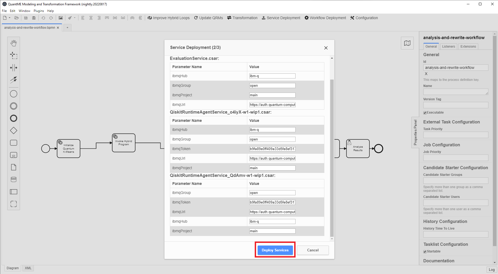

All services for this use case are deployed as Docker containers in a local [Docker-in-Docker (dind)](https://hub.docker.com/_/docker) container.
To upload the hybrid programs to Qiskit Runtime, an IBMQ access token is required, which can be retrieved from the [IBM Quantum Experience website](https://quantum-computing.ibm.com/).
Furthermore, the URL to the IBMQ service to use (e.g., https://auth.quantum-computing.ibm.com/api), the IBMQ hub (e.g., ibm-q), the IBMQ group (e.g., open), and the IBMQ project (e.g., main) must be defined for all services accessing quantum computers or using hybrid programs.
In principle, different input parameters could be used for the various services.
However, for the sake of simplicity, we utilize the same input parameters for all services.
After adding the input parameters, click on the ``Deploy Services`` button, and wait until the deployment finishes.
Then, the screen below is shown:

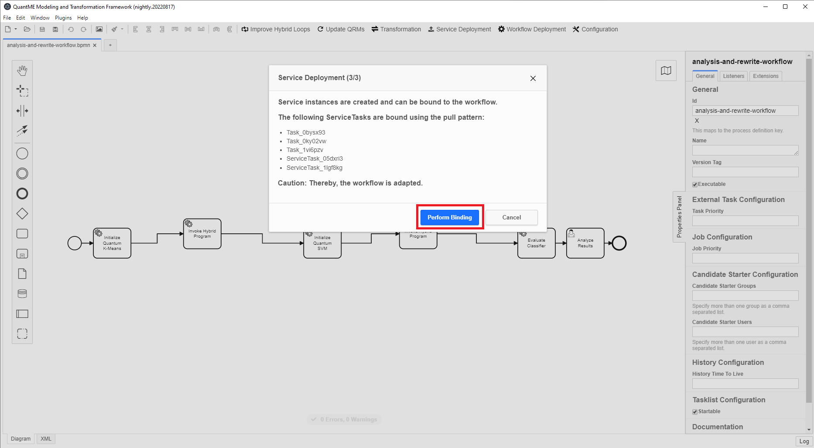

In the last step of the service deployment, the newly created service instances are bound to the workflow.
For this, click on the ``Perform Binding`` button.

Finally, the workflow model can be deployed to the [Camunda engine](https://camunda.com/products/camunda-platform/bpmn-engine/), by clicking on the ``Workflow Deployment`` button in the toolbar:

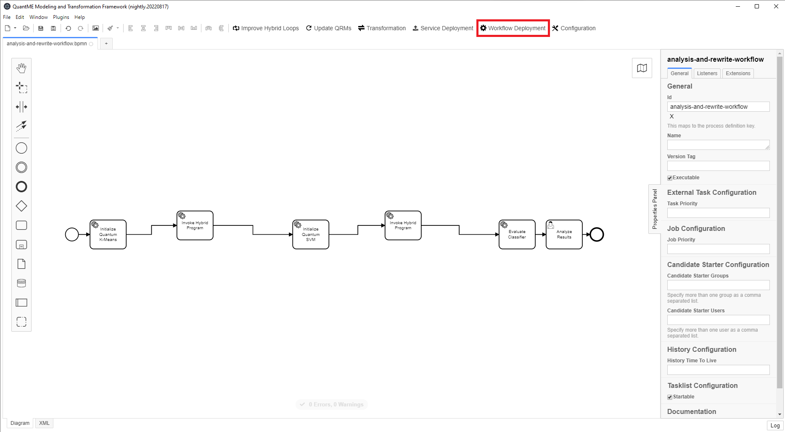

## Executing the Quantum Workflow

After successfully deploying all required services and the workflow model, open the URL of the Camunda BPMN engine: ``$PUBLIC_HOSTNAME:8080/camunda``

First, create an account in the Camunda engine and log in.
Then, the following screen is displayed:

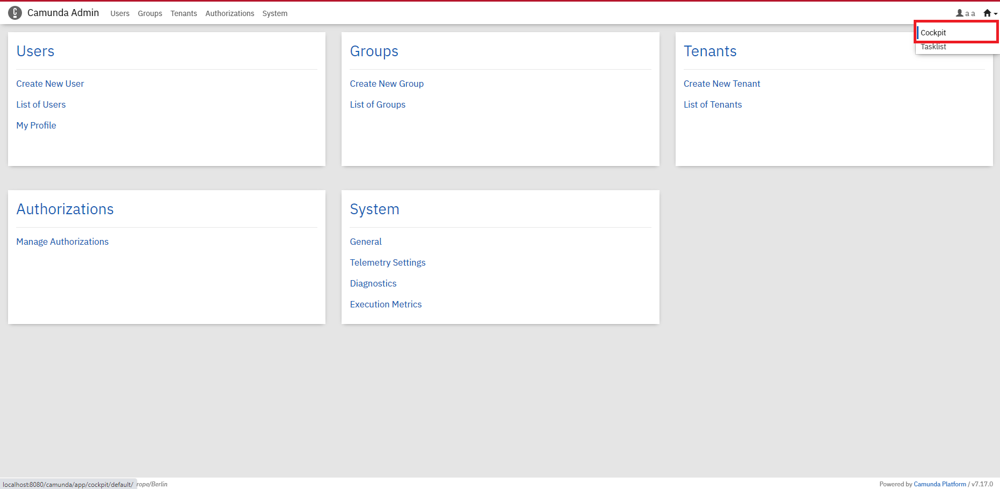

Switch to the Camunda cockpit application by clicking on the top-right and selecting ``Cockpit``:

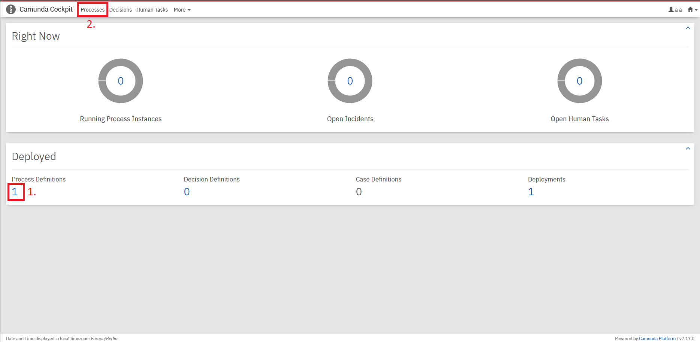

If the workflow model was successfully deployed in the [deployment step](#deploying-the-required-services), a 1 should be displayed under the ``Process Definitions`` label.
Click on ``Processes`` on the top to get a list of all deployed workflow models:

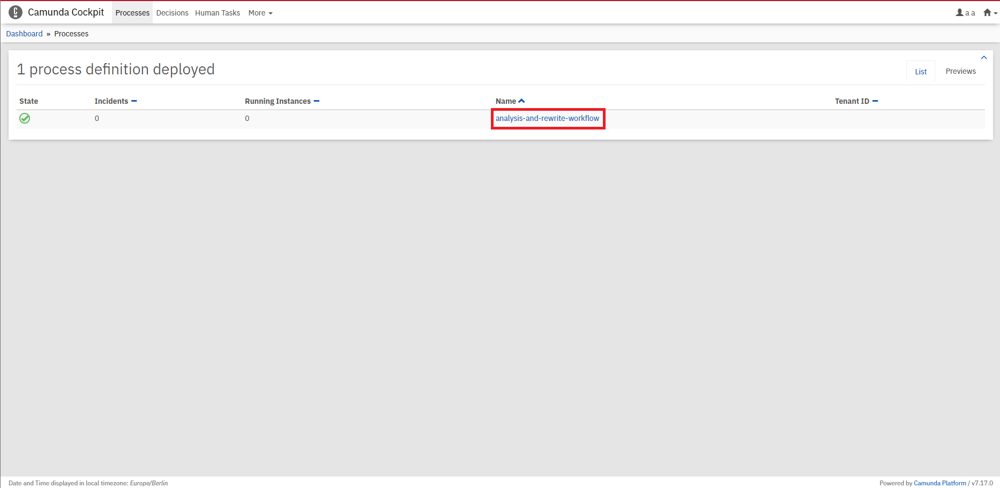

Select the previously modeled and deployed workflow model by clicking on its name, which opens a screen where the workflow model is shown.
In this screen, the token flow can be observed during workflow execution, i.e., it is visualized which activity of the workflow model is currently executed.
Furthermore, the current values of the different variables in the workflow are displayed.
The token flow, as well as the current variables, can also be visualized for the process view comprising the modeled workflow before rewriting.
To execute the workflow, open another tab with the Camunda tasklist application by clicking on the top-right and selecting ``Tasklist``:

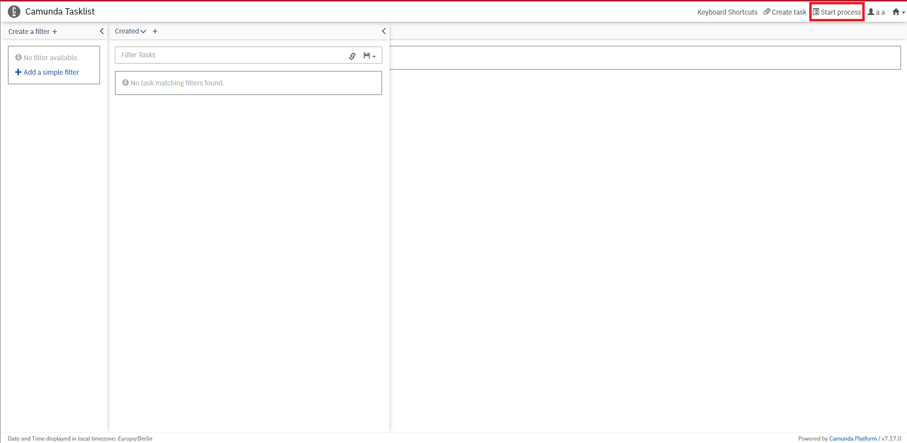

To instantiate the workflow model, select ``Start process`` on the top-right and click on the name of the workflow in the pop-up menu.
Next, the required input parameters for the instantiation are shown, which were defined in the start event form of the workflow:


Provide your IBMQ access token, as well as one of the QPUs available over IBMQ (``ibmq_lima`` in the example) as input parameters.
Please make sure to provide the same IBMQ access token as used for the deployment of the hybrid programs, as they are deployed in private mode at the moment and are only visible to the user to which the token belongs.
Furthermore, the URL to the input data has to be passed as a parameter.
Thereby, the [pre-processed data](./data) is available in this repository.
Thus, an example URL to one of the data sets is as follows: ``https://raw.githubusercontent.com/UST-QuAntiL/QuantME-UseCases/master/2022-sncs/data/embedding-10.txt``

After entering the input parameters, click on ``Start``.
The UI displays a notification at the bottom-right that the workflow instance was successfully started.
Switch back to the Camunda cockpit application to observe the token flow in the workflow:

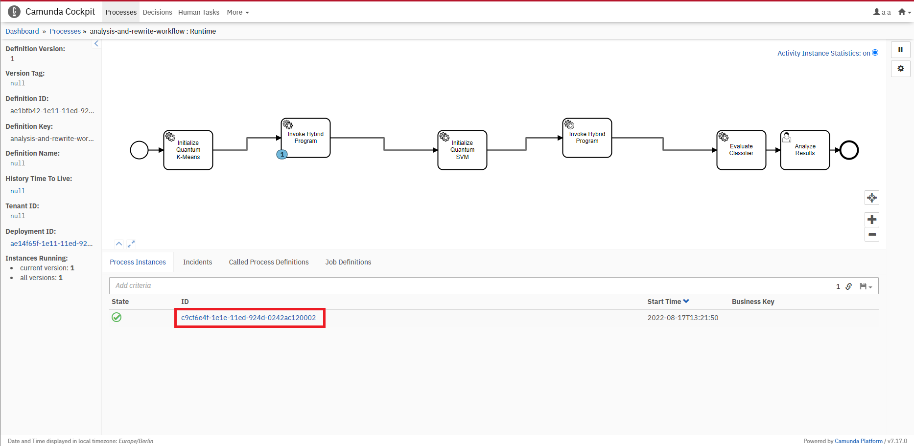

Click on the corresponding workflow instance at the bottom, to view more details, such as the current values of the variables:

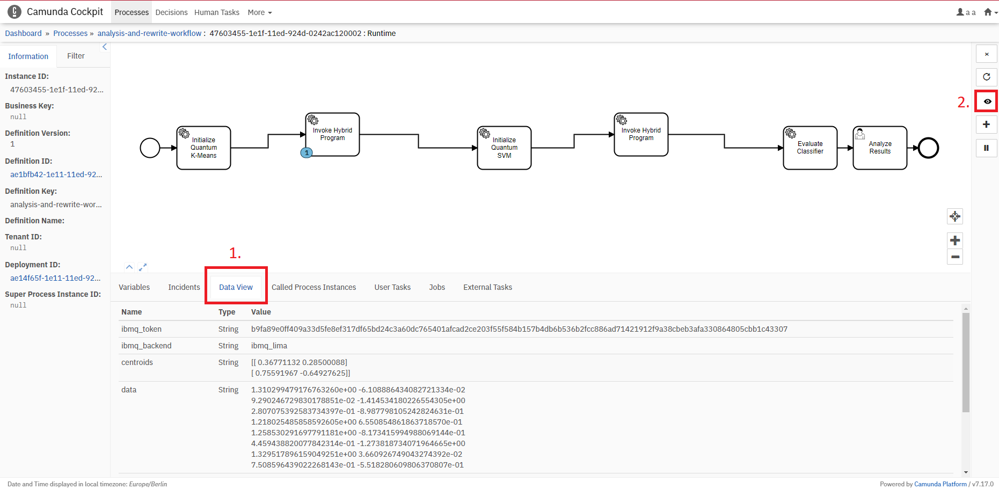

Switch to the ``Data View`` tab to visualize the variables for the different views:


To switch between the views, click on the button on the right side of the viewer:

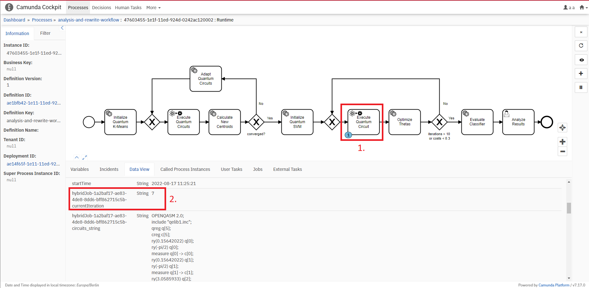

Now the token flow within the modeled workflow is visualized, i.e., in the example, a quantum circuit is currently executed within the hybrid program.
Thus, more details about the current state of the execution is visualized by using this view.

TODO