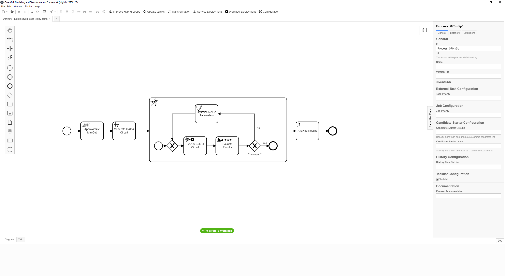
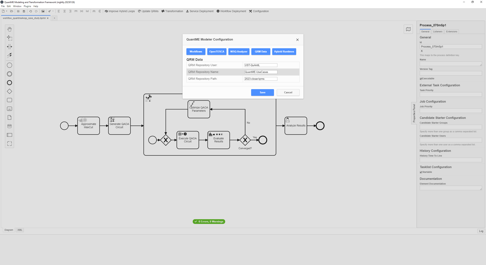
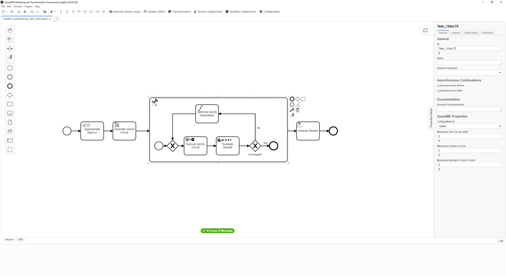
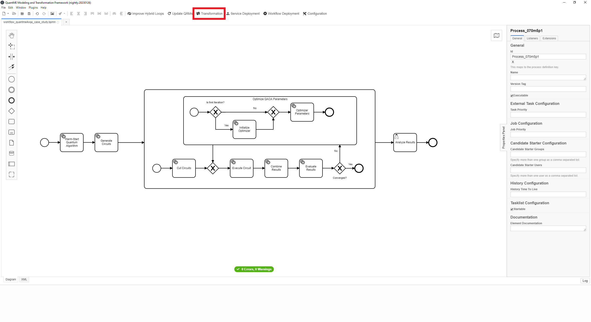
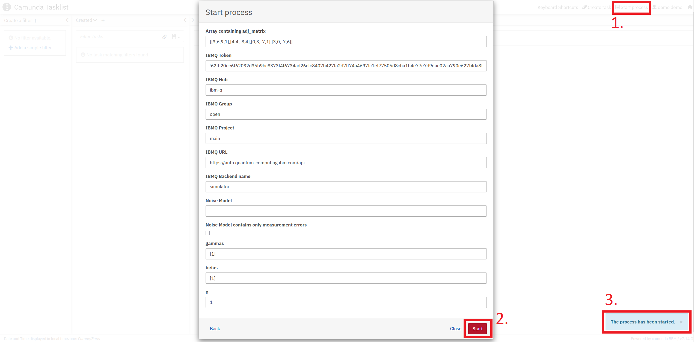
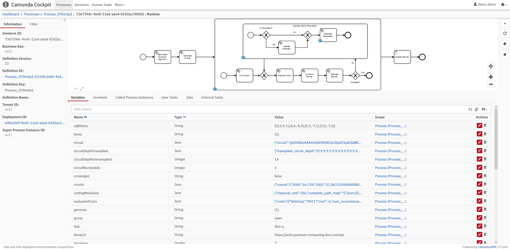
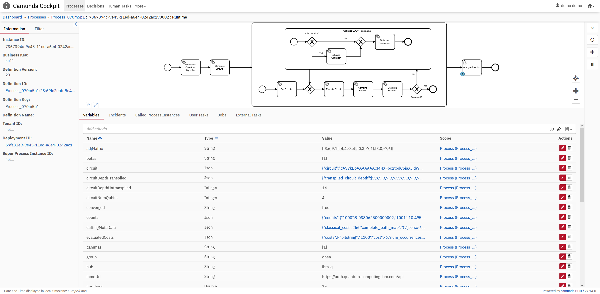
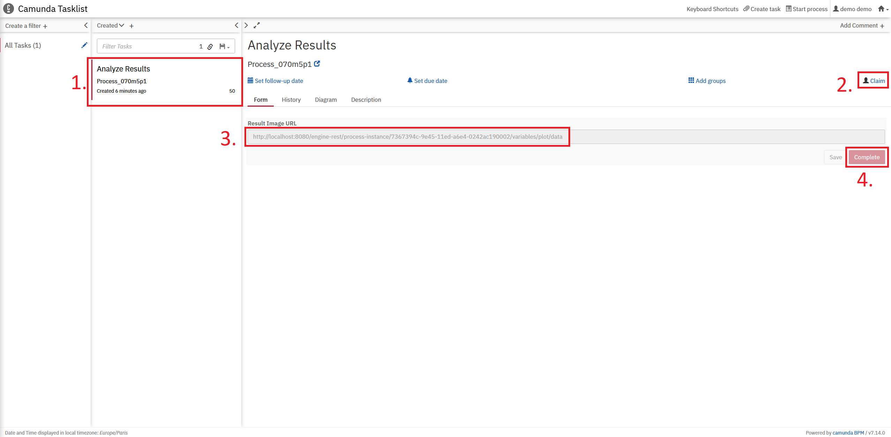

# CLOSER 2023 Prototype

Variational Quantum Algorithms (VQAs) comprise various complex reoccurring tasks that are not part of the original set of [QuantME modeling constructs](https://www.iaas.uni-stuttgart.de/publications/Weder2020_QuantumWorkflows.pdf), e.g., parameter optimization or objective function evaluation.
As the lack of modeling support for these tasks complicates the process of modeling VQAs in workflows, we developed an extension for QuantME that introduces a new set of modeling constructs specifically tailored for VQAs.

In the following sections, we showcase how these new QuantME4VQA modeling constructs can be used to model and execute an exemplary VQA that solves the Maximum Cut (MaxCut) problem using the [Quantum Approximate Optimization Algorithm (QAOA)](https://arxiv.org/pdf/1411.4028.pdf).

The use case utilizes the QuantME Transformation Framework and Quokka:

* [QuantME Modeling and Transformation Framework](https://github.com/UST-QuAntiL/QuantME-TransformationFramework): A graphical BPMN modeler to define quantum workflows, as well as analyzing and rewriting them for the usage of hybrid runtimes.
* [Quokka](https://github.com/UST-QuAntiL/Quokka): A microservice ecosystem enabling a service-based execution of quantum algorithms.

## Setup

First, we will discuss the steps required to set up the different components.
All components except the QuantME Modeling and Transformation Framework, providing the graphical BPMN modeler, are available via Docker.
Therefore, these components can be started using the Docker-Compose file available [here](./docker):

1. Update the [.env](./docker/ip.env) file with your settings: 
  * ``PUBLIC_HOSTNAME``: Enter the hostname/IP address of your Docker engine. Do *not* use ``localhost``.

2. Run the Docker-Compose file:
```
docker-compose pull
docker-compose up --build
```

3. Wait until all containers are up and running. This may take some minutes.

To start the QuantME Modeling and Transformation Framework, please execute the following steps:

1. Clone the repository using release v1.8.0: 
```
git clone https://github.com/UST-QuAntiL/QuantME-TransformationFramework.git --branch v1.8.0
```

2. Move to the cloned folder and build the framework:
```
npm install
npm run build
```

3. The build product can be found in the ``dist`` folder and started depending on the operating system, e.g., using the ``.exe`` for Windows.

Afterwards, the following screen should be displayed:


Open the example workflow model available [here](./workflow/analysis-and-rewrite-workflow.bpmn) using the QuantME Modeling and Transformation Framework.
For this, click on ``File`` in the top-left corner, and afterwards, select the workflow model in the dialogue ``Open File...``.
Then, the following screen is displayed:



The QuantME Modeling and Transformation Framework must be configured with the endpoints of the workflow engine and the QRM repository.
For this, click on ``Configuration`` in the toolbar, opening the config pop-up:



Please update the different configuration properties using the following values.
Thereby, $IP has to be replaced with the IP-address of the Docker engine used for the setup described above:

* ``BPMN`` tab:
    * ``Camunda Engine Endpoint``: http://$IP:8080/engine-rest
* ``QRM Data`` tab:
    * ``QRM Repository User``: UST-QuAntiL
    * ``QRM Repository Name``: QuantME-UseCases
    * ``QRM Repository Path``: 2023-closer/qrms


### Configuring, Transforming and Executing the Quantum Workflow

The imported workflows starts of with a warm-starting task, which is used to approximate a solution that is incorporated into the quantum circuit to facilitate the search for the optimal solution.
Next, it generates a parameterized QAOA circuit for MaxCut.
This circuit, is then cut into smaller sub-circuits by the circuit cutting sub-process, which are subsequently executed.
Afterwards, the results of the sub-circuits are combined to construct the original circuit's result.
This result is evaluated and used to optimize the QAOA parameters, starting another iteration of the loop.
Once the optimization is converged the result is returned to the user for analysis.

QuantME4VQA enables the configuration of the warm-starting, optimization and circuit-cutting via the properties panel (see on the right).



Before executing the workflow it has to be transformed into a BPMN standard-compliant workflow.
Thus, click the ``Transformation`` button.
Afterwards, all quantum-specific tasks are replaced with standard-compliant BPMN modeling elements.



Next, deploy the workflow by clicking the ``Workflow Deployment`` button.
Once it is successfully deployed, open the UI of the Camunda BPMN engine via: ``$IP:8080/camunda``

First, create an account in the Camunda engine and log in. 
Then, the following screen is displayed:


Click on the home icon in the top-right corner and select ``Tasklist``.

To instantiate the workflow model, click on ``Start process`` on the top-right and select the workflow in the pop-up menu.
Next, modify the input options according to your requirements and subsequently press ``Start``.
If the quantum circuits shall be run on a quantum device or a simulated device noise model is used, valid IBMQ credentials giving access to the device must be provided.



The UI displays a notification at the bottom-right that the workflow instance was successfully started.

Afterwards, once more click on the home icon on the top-right and select ``Cockpit``.
Click on the ``Running Process Instance``, then select the started workflow, and afterwards click on the workflow ID.
Now the workflow's token flow, and the changing variables can be observed.
To see the current state of the workflow instance refresh the page.


Wait until the token reaches the final user task in the workflow, as depicted below.
This might take some time, depending on the circuit size, the execution parameters, and the utilization of the selected QPU.


Afterwards, switch to the Camunda Tasklist via the home menu and click on ``Add a simple filter`` on the left.
Now, the task object for the human task should be visible in the task list. Click on the task object and then on the ``Claim`` button to get the URL for the plot of the execution result.


Finally, click the ``Complete`` button to finish the human task, and as it is the last activity in the workflow to terminate the workflow instance.

## Disclaimer of Warranty
Unless required by applicable law or agreed to in writing, Licensor provides the Work (and each Contributor provides its Contributions) on an "AS IS" BASIS, WITHOUT WARRANTIES OR CONDITIONS OF ANY KIND, either express or implied, including, without limitation, any warranties or conditions of TITLE, NON-INFRINGEMENT, MERCHANTABILITY, or FITNESS FOR A PARTICULAR PURPOSE. You are solely responsible for determining the appropriateness of using or redistributing the Work and assume any risks associated with Your exercise of permissions under this License.

## Haftungsausschluss
Dies ist ein Forschungsprototyp. Die Haftung für entgangenen Gewinn, Produktionsausfall, Betriebsunterbrechung, entgangene Nutzungen, Verlust von Daten und Informationen, Finanzierungsaufwendungen sowie sonstige Vermögens- und Folgeschäden ist, außer in Fällen von grober Fahrlässigkeit, Vorsatz und Personenschäden, ausgeschlossen.
