# BloQCat 2024 Tutorial

## prerequisites
- [Install Docker](https://docs.docker.com/install/)
- [Install Docker Compose](https://docs.docker.com/compose/install/)
- [Install Git](https://git-scm.com/book/en/v2/Getting-Started-Installing-Git)
- [Clone this repository](https://github.com/SeQuenC-Consortium/SeQuenC-UseCases.git)

## 1. Docker Setup
This tutorial requires certain components to run. You can set them up by default using the following steps:

Navigate to the Docker directory.
   Use the following commands:
   ```shell 
   docker-compose up db -d
   docker-compose up -d
   ```
   Note: The `-d` flag is **optional**. It runs the containers in the background (detached mode) and keeps them running even after the command execution is complete.

## 2- (Optional) Adding Concrete Solutions to QC Atlas

Once the Docker containers are running, you can begin adding concrete solutions to the QC Atlas using the steps below:

1. Open your web browser and navigate to the QC Atlas at [http://localhost:80](http://localhost:80). Once it's open, proceed to the `BloQCat -> Patterns` tab (It might take a moment for the page to load).  Here, you'll find various patterns to which you can add concrete solutions.
   

2. Select the specific pattern you want to work with (here we chosed the *Uniform Superposition Pattern*). This will take you to a page displaying all existing concrete solutions for that pattern, if any are available.
   

3. To add a new concrete solution, simply click on the `Add` button (the green button with a "+" symbol). The following dialog will appear. Please note that all fields are mandatory, but the "Qubit Count" is particularly necessary. The checkboxes for "Has Header", "Has Measurement", etc., are set to "false" by default, meaning they are considered unchecked. They will be set to "true" if clicked.
   

4. After adding the concrete solution, you will be redirected to the page of the newly added concrete solution, where you can view its details. To attach a file (specifically a QASM2 file) to the concrete solution, click on the `Attach File` button (the green button with a "+" symbol). This will open a dialog (See Screenshot) where you can select the desired file. Once the file is chosen, click on the `Upload` button to finalize attaching it to the concrete solution.

5.  On this page, you have the flexibility to add, replace, or delete the attached file at any time.
    

## 3. Creating and depolying a Topology
>Note: The [Quantum Computing Patterns](https://patterns.platform.planqk.de/pattern-languages/af7780d5-1f97-4536-8da7-4194b093ab1d) are preconfigured in the Winery as Nodetypes, along with example relationships like "Aggregation" and "Concrete Solution of" for node connections. These can be found under the "Node Types" and "Relationship Types" tabs and are also available in the Topology Modeller.
     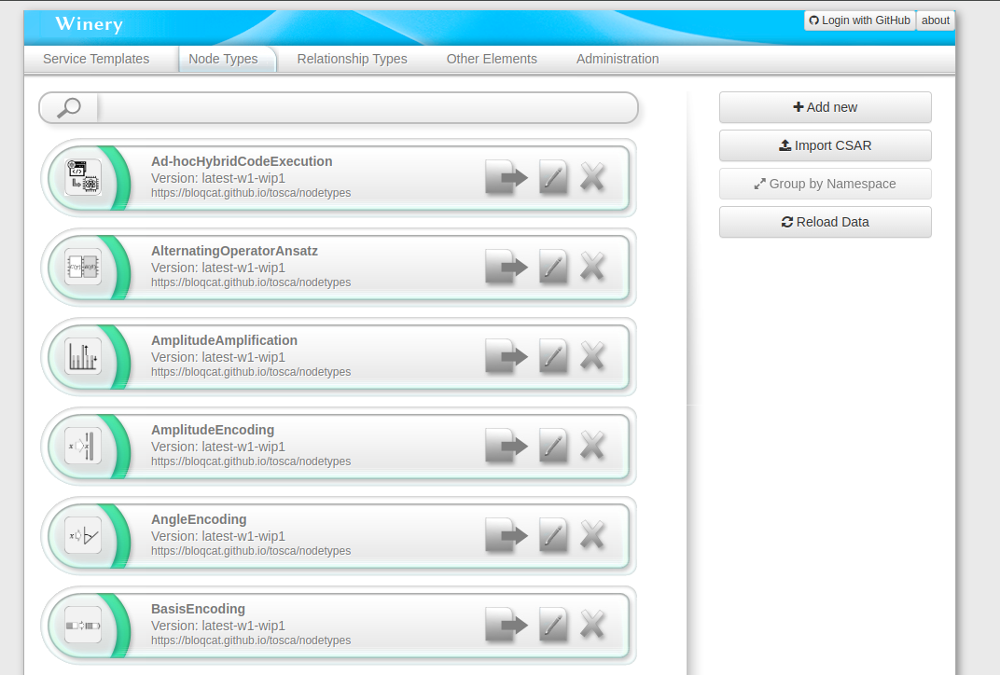
     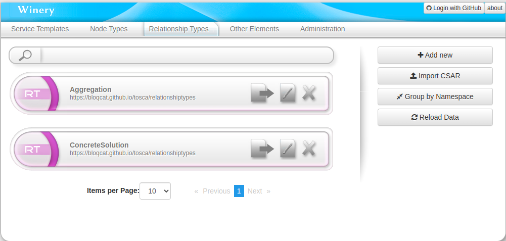


1. **Accessing Winery**:
   - Navigate to QC Atlas via [http://localhost:80](http://localhost:80).
   - Select the `BloQCat` tab. then click on the `Winery` button.
   - Alternatively, access the Winery directly at [http://localhost:8080](http://localhost:8080).

2. **Initiating a New Service Template in Winery**:
   - Upon reaching the Winery, you will see the main page.
   - Navigate to the `Service Templates` tab.
   - Start by clicking the `Add new` button to create a new Service template.
     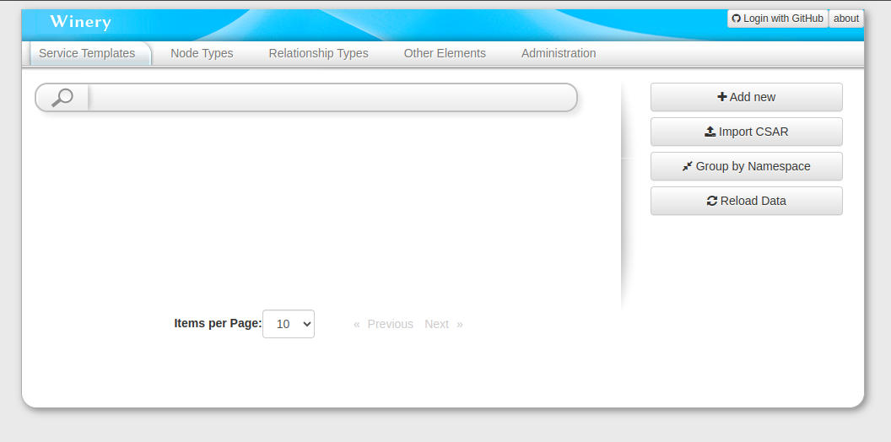

3. **Creating the Service Template**:
   - Click `Add new` to open the creation dialog.
   - Choose a name and namespace for your Service template.
   - Confirm by clicking `Add`.
     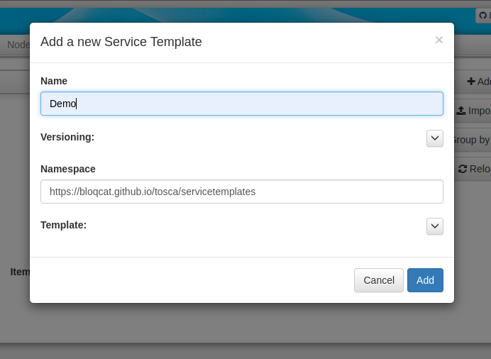

4. **Navigating to Your Service Template**:
   - Post-creation, you'll be directed to your Service template's page.
   - To start building a topology, go to the `Topology Template` tab and click `Open Editor`.
     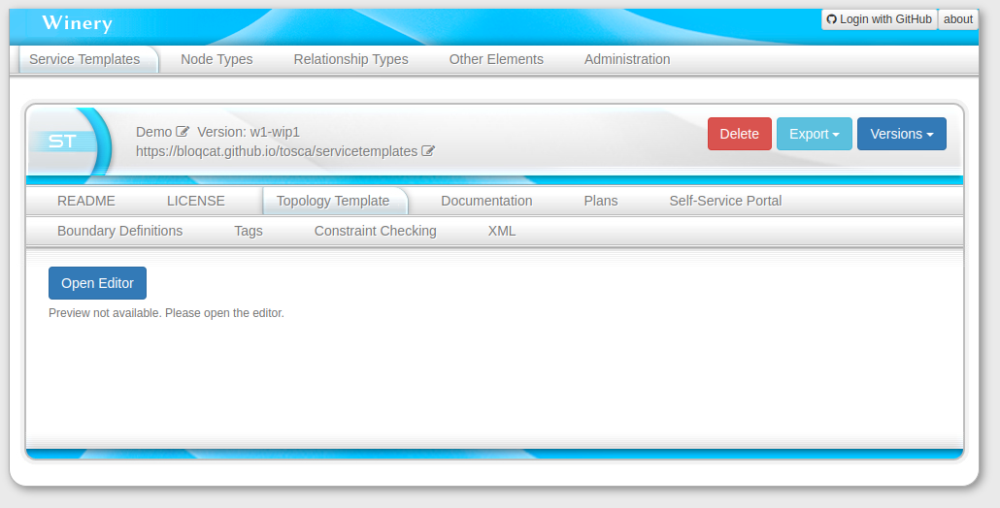

5. **Designing the Topology**:
   - In the editor, drag and drop nodes from the left panel onto the canvas.
   - Connect nodes by selecting a node, choosing a relationship, and dragging to the target node.
   - Finalize your topology by clicking the `Save` button.
     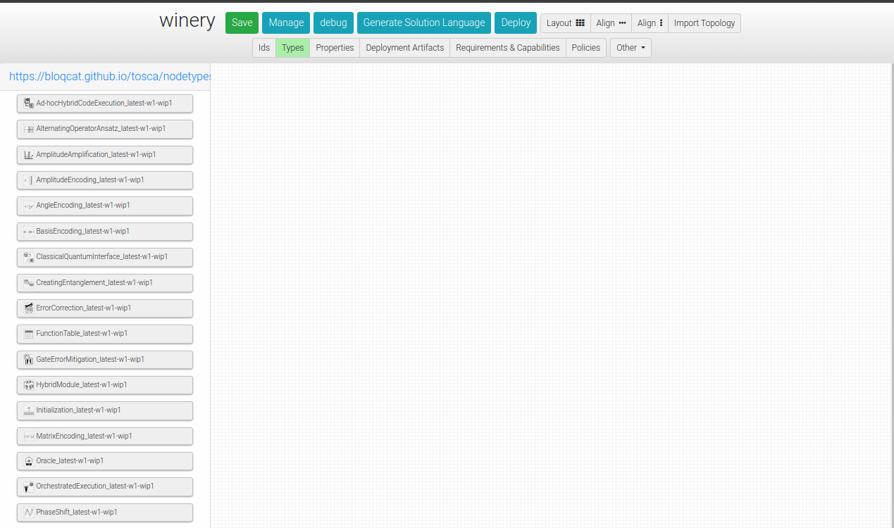
   - To demonstrate the Deutsch algorithm, add a "Oracle" and a "Uniform Superposition" node to the topology.
     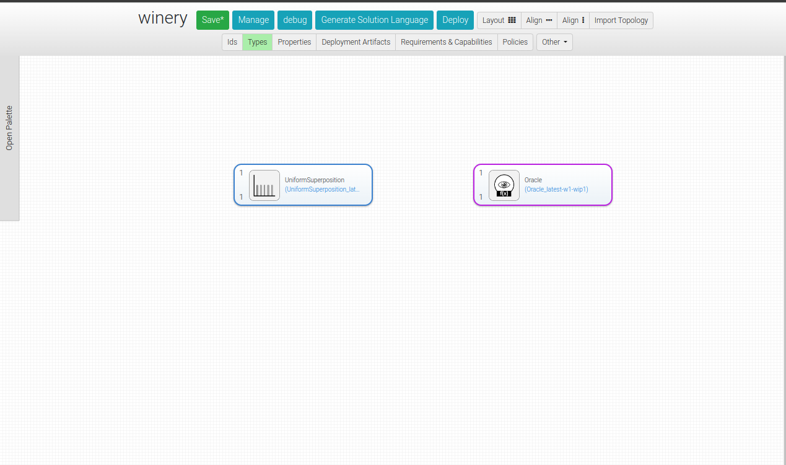
   - Connect the two nodes by selecting the "Uniform Superposition" node, choosing the "Aggregation" relationship, and dragging to the "Oracle" node.
     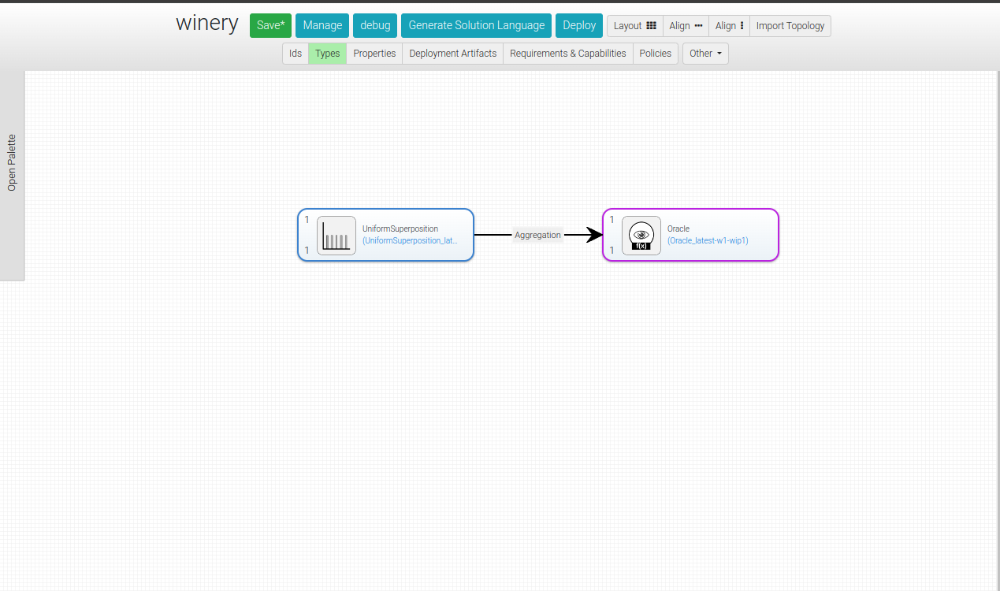

6. **Generation of Solution Language**:
   - Once your topology is saved, click on the `Generate Solution Language` button.
   - This action generates a Solution Language by incorporating all available concrete solutions for each pattern in the topology from the QC Atlas. These solutions are added as nodes and connected to their corresponding patterns using the "Concrete Solution of" relationship.
     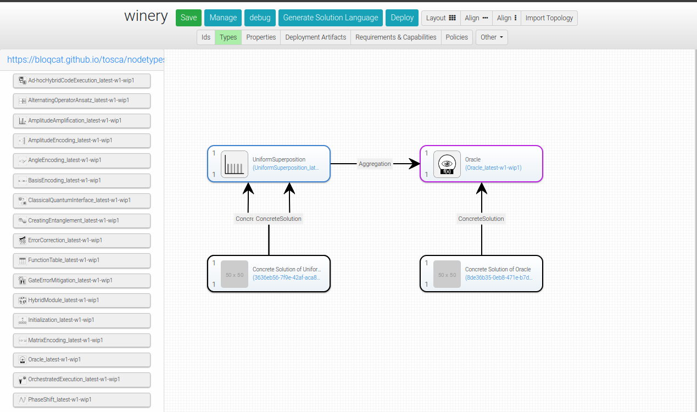

7. **Completing the Topology by Choosing Concrete Solutions**:
   - Following the generation of the Solution Language, all available concrete solutions for each pattern in the topology are displayed. Review the metadata of each concrete solution to determine compatibility.
     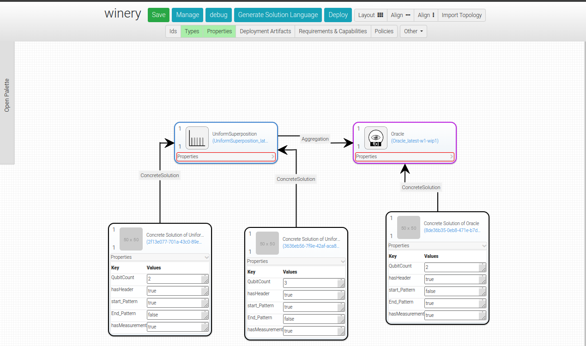
   - Once you have selected the appropriate concrete solutions, connect them using the "Aggregation" relationship. (Note: not used concrete solutions can be deleted)
     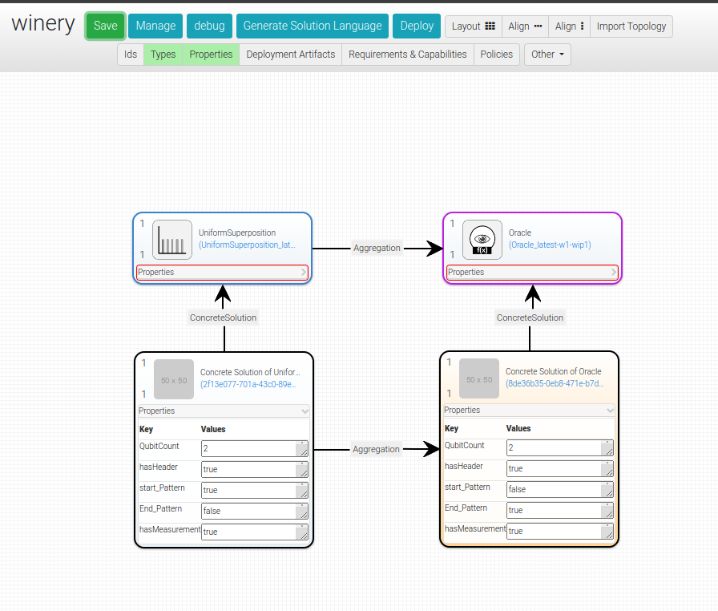

8. **Deploying the Topology**:
   - After completing the topology, click the `Deploy` button.
   - This initiates a POST-request to the BloQCat API, triggering the deployment of your topology.
   - The API responds with an aggregated "Complete Solution". This response can be viewed using your browser's inspection tool.
     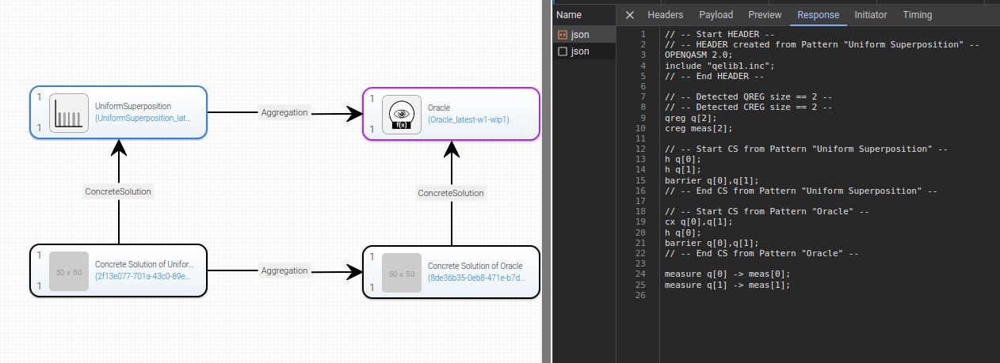


## Disclaimer of Warranty
Unless required by applicable law or agreed to in writing, Licensor provides the Work (and each Contributor provides its Contributions) on an "AS IS" BASIS, WITHOUT WARRANTIES OR CONDITIONS OF ANY KIND, either express or implied, including, without limitation, any warranties or conditions of TITLE, NON-INFRINGEMENT, MERCHANTABILITY, or FITNESS FOR A PARTICULAR PURPOSE. You are solely responsible for determining the appropriateness of using or redistributing the Work and assume any risks associated with Your exercise of permissions under this License.

## Haftungsausschluss
Dies ist ein Forschungsprototyp. Die Haftung für entgangenen Gewinn, Produktionsausfall, Betriebsunterbrechung, entgangene Nutzungen, Verlust von Daten und Informationen, Finanzierungsaufwendungen sowie sonstige Vermögens- und Folgeschäden ist, außer in Fällen von grober Fahrlässigkeit, Vorsatz und Personenschäden, ausgeschlossen.
