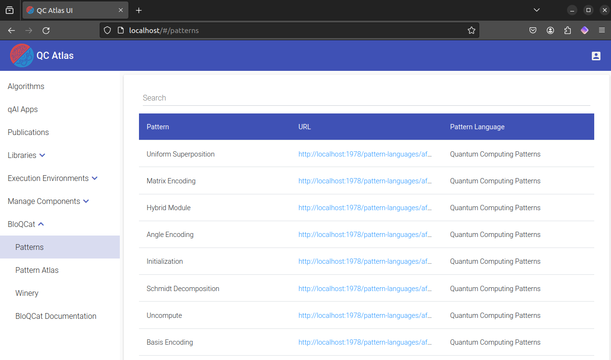
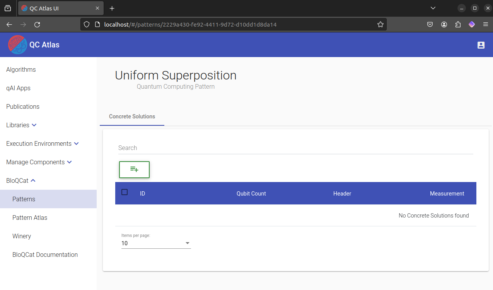
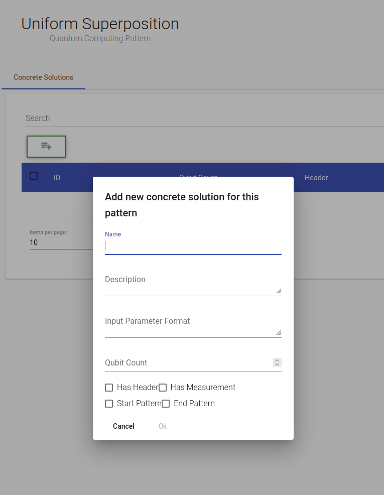
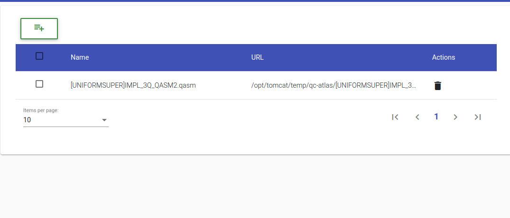

# BloQCat 2024 Tutorial

## prerequisites
- [Install Docker](https://docs.docker.com/install/)
- [Install Docker Compose](https://docs.docker.com/compose/install/)
- [Install Git](https://git-scm.com/book/en/v2/Getting-Started-Installing-Git)
- [Clone this repository](https://github.com/SeQuenC-Consortium/SeQuenC-UseCases.git)

## 1. Docker Setup
This tutorial requires certain components to run. You can set them up by default using the following steps:

Navigate to the Docker directory.
   Use the following commands:
   ```shell 
   docker-compose up db -d
   docker-compose up -d
   ```
   Note: The `-d` flag is **optional**. It runs the containers in the background (detached mode) and keeps them running even after the command execution is complete.

## 2- (Optional) Adding Concrete Solutions to QC Atlas

Once the Docker containers are running, you can begin adding concrete solutions to the QC Atlas using the steps below:

1. Open your web browser and navigate to the QC Atlas at [http://localhost:80](http://localhost:80). Once it's open, proceed to the `BloQCat -> Patterns` tab (It might take a moment for the page to load).  Here, you'll find various patterns to which you can add concrete solutions.
   

2. Select the specific pattern you want to work with (here we chosed the *Uniform Superposition Pattern*). This will take you to a page displaying all existing concrete solutions for that pattern, if any are available.
   

3. To add a new concrete solution, simply click on the `Add` button (the green button with a "+" symbol). The following dialog will appear. Please note that all fields are mandatory, but the "Qubit Count" is particularly necessary. The checkboxes for "Has Header", "Has Measurement", etc., are set to "false" by default, meaning they are considered unchecked. They will be set to "true" if clicked.
   

4. After adding the concrete solution, you will be redirected to the page of the newly added concrete solution, where you can view its details. To attach a file (specifically a QASM2 file) to the concrete solution, click on the `Attach File` button (the green button with a "+" symbol). This will open a dialog (See Screenshot) where you can select the desired file. Once the file is chosen, click on the `Upload` button to finalize attaching it to the concrete solution.

5.  On this page, you have the flexibility to add, replace, or delete the attached file at any time.
    

## Disclaimer of Warranty
Unless required by applicable law or agreed to in writing, Licensor provides the Work (and each Contributor provides its Contributions) on an "AS IS" BASIS, WITHOUT WARRANTIES OR CONDITIONS OF ANY KIND, either express or implied, including, without limitation, any warranties or conditions of TITLE, NON-INFRINGEMENT, MERCHANTABILITY, or FITNESS FOR A PARTICULAR PURPOSE. You are solely responsible for determining the appropriateness of using or redistributing the Work and assume any risks associated with Your exercise of permissions under this License.

## Haftungsausschluss
Dies ist ein Forschungsprototyp. Die Haftung für entgangenen Gewinn, Produktionsausfall, Betriebsunterbrechung, entgangene Nutzungen, Verlust von Daten und Informationen, Finanzierungsaufwendungen sowie sonstige Vermögens- und Folgeschäden ist, außer in Fällen von grober Fahrlässigkeit, Vorsatz und Personenschäden, ausgeschlossen.
