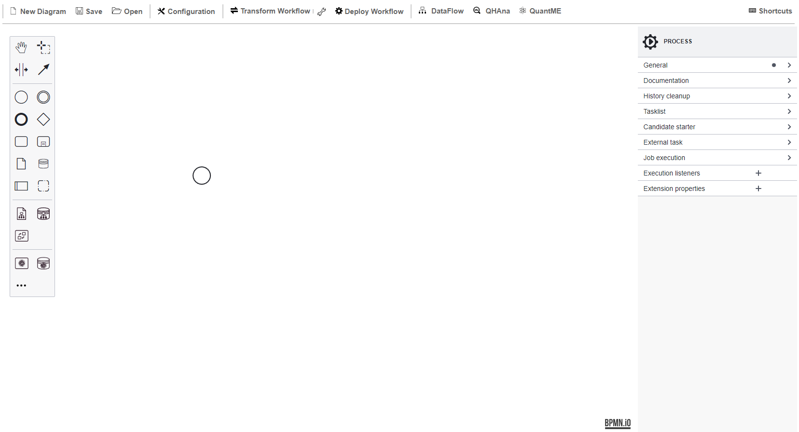

# CAiSE 2024 Prototype

TODO

## Setup

To set up the required components for the use case, a machine with a publicly accessible IP is required, e.g., hosted in the cloud.
All components are available via Docker.
Therefore, these components can be started using the Docker-Compose file available [here](./docker):

1. Update the [.env](./docker/.env) file with your settings:
  * ``PUBLIC_HOSTNAME``: Enter the publicly accessible IP address of your Docker engine. Do *not* use ``localhost``.
  * ``IBM_ACCESS_TOKEN``: Enter your IBMQ token, which can be retrieved [here](https://quantum-computing.ibm.com/).

2. Run the Docker-Compose file:
```
docker-compose pull
docker-compose up --build
```

3. Wait until all containers are up and running. This may take some minutes.

Open the Quantum Workflow Modeler using the following URL: [localhost:8080](http://localhost:8080)

Afterwards, the following screen should be displayed:



Open the example workflow model available [here](./workflow/caise_workflow.bpmn) using the Quantum Workflow Modeler.
For this, click on ``Open`` in the top-left corner, and afterwards, select the workflow model.
Then, the following screen is displayed:


The Quantum Workflow Modeler is pre-configured with the endpoints of the workflow engine and the QRM repository.
To check these settings, click on ``Configuration`` in the toolbar, opening the config pop-up:


Please verify that the different configuration properties are set to the following values.
Thereby, $IP has to be replaced with the IP address of the Docker engine used for the setup described above:

* Under ``General``:
    * ``Camunda Engine Endpoint``: http://$IP:8080/engine-rest
* Under ``GitHub``:
    * ``QRM Repository User``: UST-QuAntiL
    * ``QRM Repository Name``: QuantME-UseCases
    * ``QRM Repository Path``: 2024-caise/qrms
* Under ``QuantME Plugin``:
    * ``TODO``: TODO
* Under ``OpenTOSCA Plugin``:
    * ``TODO``: TODO

### TODO

TODO

## Disclaimer of Warranty
Unless required by applicable law or agreed to in writing, Licensor provides the Work (and each Contributor provides its Contributions) on an "AS IS" BASIS, WITHOUT WARRANTIES OR CONDITIONS OF ANY KIND, either express or implied, including, without limitation, any warranties or conditions of TITLE, NON-INFRINGEMENT, MERCHANTABILITY, or FITNESS FOR A PARTICULAR PURPOSE. You are solely responsible for determining the appropriateness of using or redistributing the Work and assume any risks associated with Your exercise of permissions under this License.

## Haftungsausschluss
Dies ist ein Forschungsprototyp. Die Haftung für entgangenen Gewinn, Produktionsausfall, Betriebsunterbrechung, entgangene Nutzungen, Verlust von Daten und Informationen, Finanzierungsaufwendungen sowie sonstige Vermögens- und Folgeschäden ist, außer in Fällen von grober Fahrlässigkeit, Vorsatz und Personenschäden, ausgeschlossen.
