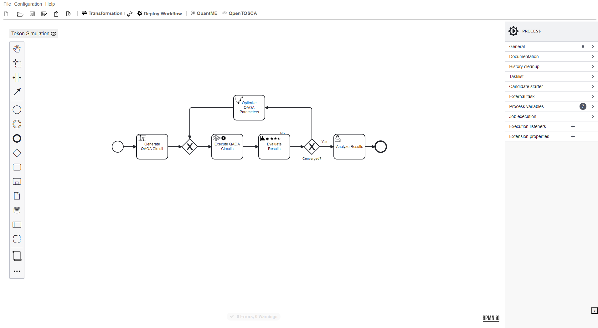
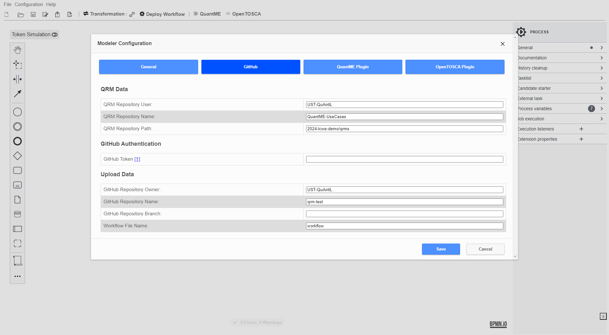
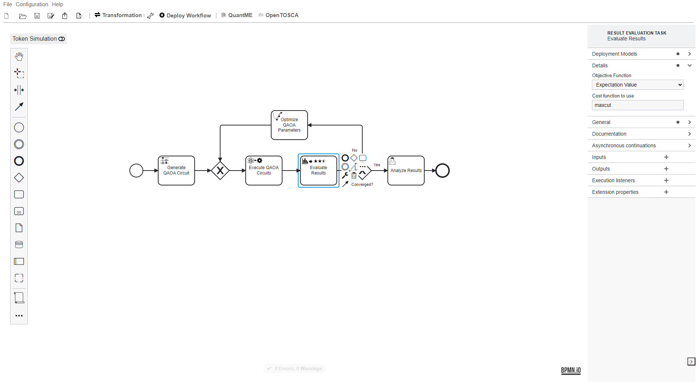
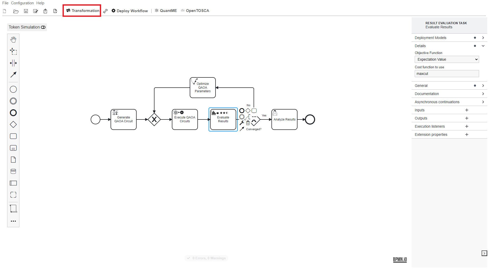
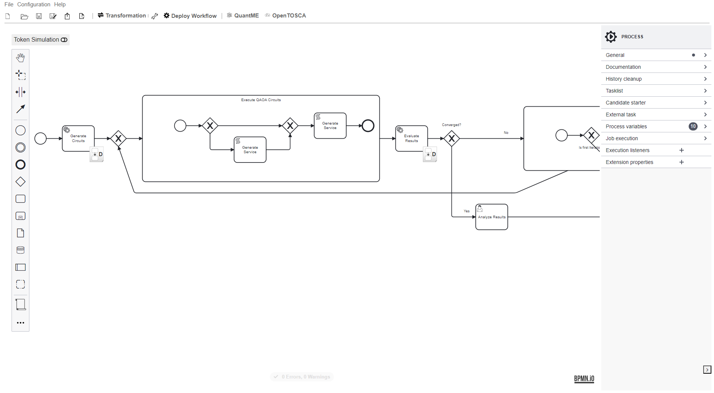
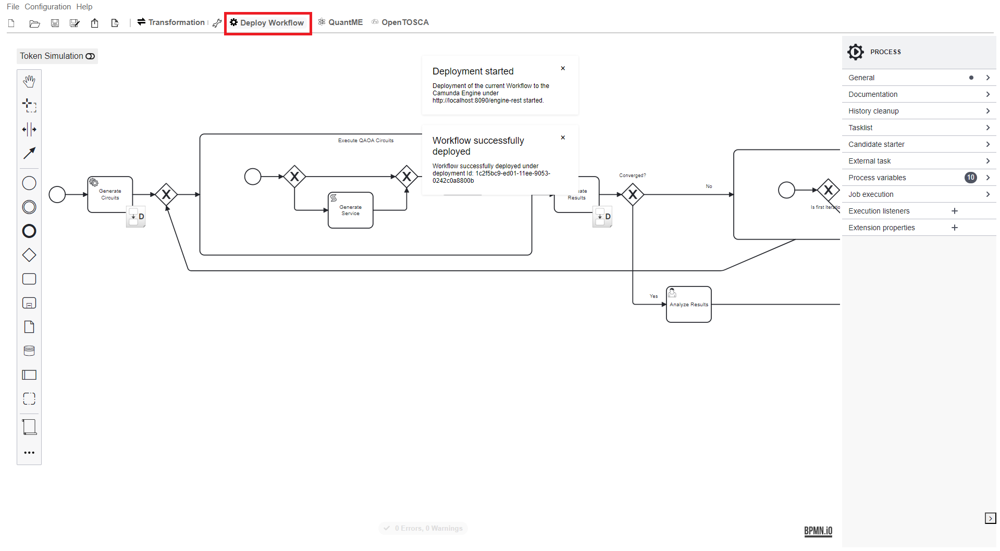
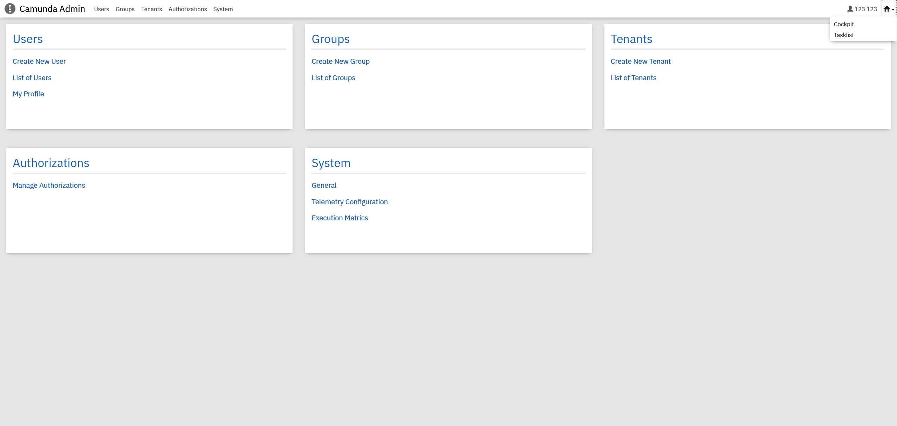
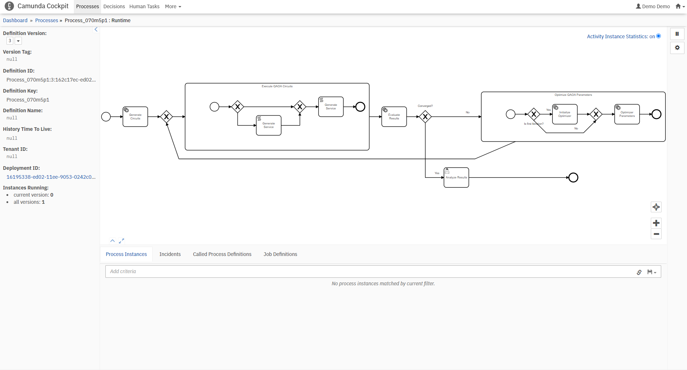
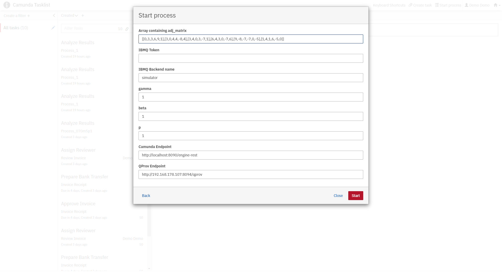
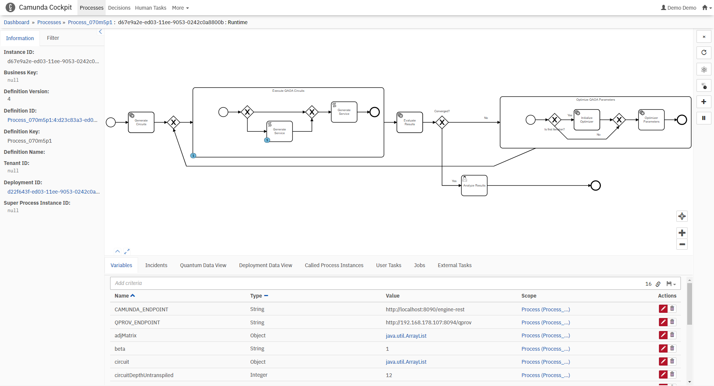

# ICWE 2024 Demonstration Prototype

The increasing availability of quantum devices via the cloud led to a multitude of commercial and scientific tools for developing quantum applications.
However, since quantum applications are typically hybrid, comprising both quantum and classical parts, these tools are very heterogeneous.
Therefore, combining them within a single application is complicated by incompatible programming languages, data formats, and interfaces.
Hence, to enable the development of portable and interoperable quantum applications a standards-based toolchain is required.
In this demonstration, we present a holistic toolchain for developing quantum applications utilizing well-established standards for defining workflows, deployment topologies, application interfaces, and provenance data.

## Setup

First, we will discuss the steps required to set up the different components.
All components are available via Docker.
Therefore, these components can be started using the Docker-Compose file available [here](./docker):

1. Update the [.env](./docker/.env) file with your settings:
  * ``PUBLIC_HOSTNAME``: Enter the hostname/IP address of your Docker engine. Do *not* use ``localhost``.

2. Run the Docker-Compose file:
```
docker-compose pull
docker-compose up --build
```

3. Wait until all containers are up and running. This may take some minutes.

Open the Quantum Workflow Modeler using the following URL: [localhost:8080](http://localhost:8080)

Afterwards, the following screen should be displayed:


Open the example workflow model available [here](./workflow/machine_learning_use_case.bpmn) using the Quantum Workflow Modeler.
For this, click on ``Open`` in the top-left corner, and afterwards, select the workflow model in the dialogue ``Open File...``.
Then, the following screen is displayed:



The Quantum Workflow Modeler is pre-configured with the endpoints of the workflow engine and the QRM repository.
To check these settings, click on ``Configuration`` in the toolbar, opening the config pop-up:



Please verify that the different configuration properties are set to the following values.
Thereby, $IP has to be replaced with the IP-address of the Docker engine used for the setup described above:

* Under ``General``:
  * ``Camunda Engine Endpoint``: http://$IP:8080/engine-rest
* Under ``GitHub``:
  * ``QRM Repository User``: UST-QuAntiL
  * ``QRM Repository Name``: QuantME-UseCases
  * ``QRM Repository Path``: 2024-icwe-demo/qrms
* Under ``OpenTOSCA Plugin``:
  * ``OpenTOSCA Endpoint:``: http://$IP:1337/csars
  * ``Winery Endpoint:``: http://$IP:8093/winery
* Under ``QuantME Plugin``:
  * ``QProv Endpoint``: http://$IP:8094/qprov

### Configuring, Transforming, and Executing the Quantum Workflow

The imported workflows starts of with a quantum circuit loading task that generates a parameterized QAOA circuit for MaxCut.
Afterwards, the circuit is executed and subsequently evaluated by a result evaluation task.
Subsequently, the circuit parameters are optimized by a parameter optimization task for the next iteration of the quantum algorithm.
Once the optimization is converged, the result is returned to the user for analysis.



To execute the workflow, the QuantME modeling constructs must be replaced by standard-compliant BPMN modeling constructs.
Therefore, click on the ``Transformation`` button.



The resulting native workflow model, that will automatically be opened in a new tab, is displayed below.
For example, the Warm-Starting Task and Quantum Circuit Loading Task are replaced by two Service Tasks invoking the corresponding services of the Quokka ecosystem based on the configuration attributes.
Additionally, new Service Tasks are inserted to split the quantum circuit, as well as to combine the results after the execution.



Next, deploy the workflow by clicking the ``Deploy Workflow`` button.



Open the Camunda Engine using the following URL: [$IP:8090](http://$IP:8090)
Use ``demo`` as username and password to log in, which displays the following screen:



Click on the home icon in the top-right corner and select ``Cockpit`` to validate that the workflow was successfully uploaded.
Then, click on ``Processes`` on the top-left and select the workflow from the list.
This should show a graphical representation of the uploaded workflow:



To instantiate the workflow, click the home button on the top-right, then select ``Tasklist``.
Next, click on ``Start process`` on the top-right, select the name of the uploaded workflow, and provide the input parameters as shown below:

* ``adjMatrix``: ``[[0,2,1],[3,0,1],[1,2,0]]``
* ``betas``: ``1``
* ``gammas``: ``1``
* ``token``: ``YOUR_IBMQ_TOKEN`` (can be left empty when using the aer simulator (default))



The UI displays a notification at the bottom-right that the workflow instance was successfully started.
Afterwards, once more, click on the home icon on the top-right and select Cockpit. 
Click on the running process instance, select the started workflow, and then click on the workflow ID. 
Now the workflow's token flow and the changing variables can be observed. 
To see the current state of the workflow instance refresh the page.



Wait until the token reaches the final user task in the workflow, as depicted below.
This might take some time, depending on the circuit size, the execution parameters, and the utilization of the selected quantum device or simulator.

## Disclaimer of Warranty
Unless required by applicable law or agreed to in writing, Licensor provides the Work (and each Contributor provides its Contributions) on an "AS IS" BASIS, WITHOUT WARRANTIES OR CONDITIONS OF ANY KIND, either express or implied, including, without limitation, any warranties or conditions of TITLE, NON-INFRINGEMENT, MERCHANTABILITY, or FITNESS FOR A PARTICULAR PURPOSE. You are solely responsible for determining the appropriateness of using or redistributing the Work and assume any risks associated with Your exercise of permissions under this License.

## Haftungsausschluss
Dies ist ein Forschungsprototyp. Die Haftung für entgangenen Gewinn, Produktionsausfall, Betriebsunterbrechung, entgangene Nutzungen, Verlust von Daten und Informationen, Finanzierungsaufwendungen sowie sonstige Vermögens- und Folgeschäden ist, außer in Fällen von grober Fahrlässigkeit, Vorsatz und Personenschäden, ausgeschlossen.
