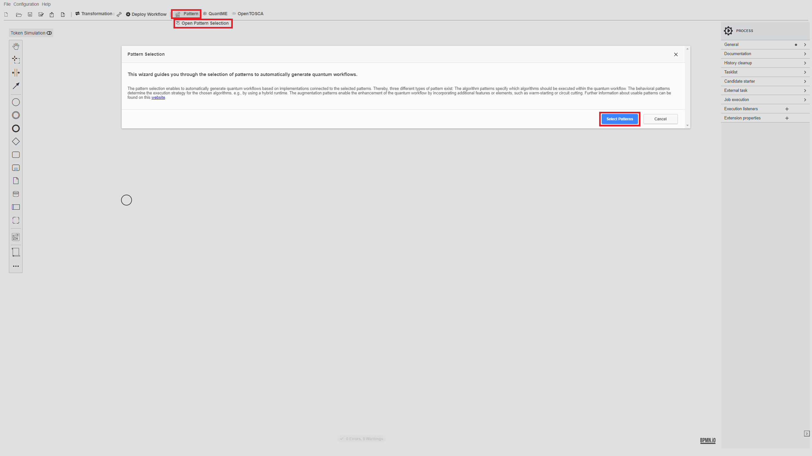
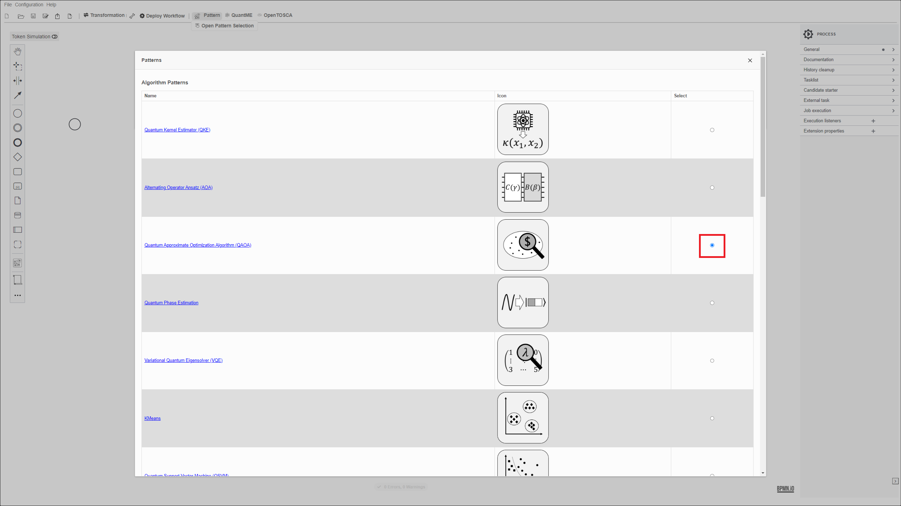

# ICSCA 2025 Prototype

This use case folder comprises the following data:

# Case Study

Building quantum applications requires deep knowledge of quantum computing and software engineering.
Hence, an abstraction layer reducing the complexity for non-experts is required.
Patterns are an established concept for abstractly describing proven solution strategies to recurring problems.
Therefore, the quantum computing patterns, a pattern language for the quantum computing domain, can be used to define the building blocks and the structure of hybrid quantum applications.
Furthermore, concrete software artifacts can be associated with patterns to solve the corresponding problem.
However, identifying suitable patterns for tackling a specific application scenario and subsequently combining them in an application is a time-consuming manual task.  
To overcome this issue, we present an approach that enables the automated detection of patterns solving a given problem, the selection of suitable implementations fulfilling non-functional requirements of the user, and the automated aggregation of these solutions into an executable quantum application.


The use case utilizes the following components:

* [Winery](https://github.com/OpenTOSCA/winery): Winery is a web-based environment to graphically model TOSCA-based deployment models, which can then be attached to activities of quantum workflows to enable their automated deployment in the target environment.
* [OpenTOSCA Container](https://github.com/OpenTOSCA/container): A TOSCA-compliant deployment system to deploy and manage applications or services.
* [Pattern Atlas UI](https://github.com/PatternAtlas/pattern-atlas-ui): The Pattern Atlas UI is a graphical interface designed to visualize patterns for different pattern languages.
* [Text Matching Server](https://github.com/UST-QuAntiL/text-matching-server): A backend service that supports comparisons between text-based descriptions.


## Setup


First, we will discuss the steps required to set up the different components.
All components are available via Docker.
Therefore, these components can be started using the Docker-Compose file available [here](./docker):

1. Update the [.env](./docker/.env) file with your settings:
* ``PUBLIC_HOSTNAME``: Enter the hostname/IP address of your Docker engine. Do *not* use ``localhost``.
* ``OPENAPI_TOKEN``: Enter the OpenAPI Token to use ChatGPT 4.0.

2. Run the Docker-Compose file:
```
docker-compose pull
docker-compose up --build
```

3. Wait until all containers are up and running. This may take some minutes.

Open the Pattern Atlas UI using the following URL: [localhost:1978](http://localhost:1978).

Afterward, the following screen should be displayed:


### Harnessing Patterns to Support the Development of Hybrid Quantum Applications

To generate a hybrid quantum application, click on ``Pattern Matcher`` and enter the following context:

``Given a set of variables and a boolean logic formula, I need to determine a variable assignment that satisfies the formula, if one exists.
The resulting application should be executed using quantum computers from IBMQ.``

Afterward, click on ``Identify Patterns``.




Next, click on the ``Open Pattern Graph`` button where you can see the actual pattern graph.



Close the dialog and then click on "Aggregate solutions". This action aggregates all available solutions. Each solution is then filtered based on the non-functional requirements, where only the Qiskit implementations are selected.


Next, click on ``Done`` and then on ``Combine Solutions``.

To deploy the hybrid quantum application, click on ``Deploy Solution``.


## Disclaimer of Warranty
Unless required by applicable law or agreed to in writing, Licensor provides the Work (and each Contributor provides its Contributions) on an "AS IS" BASIS, WITHOUT WARRANTIES OR CONDITIONS OF ANY KIND, either express or implied, including, without limitation, any warranties or conditions of TITLE, NON-INFRINGEMENT, MERCHANTABILITY, or FITNESS FOR A PARTICULAR PURPOSE. You are solely responsible for determining the appropriateness of using or redistributing the Work and assume any risks associated with Your exercise of permissions under this License.

## Haftungsausschluss
Dies ist ein Forschungsprototyp. Die Haftung für entgangenen Gewinn, Produktionsausfall, Betriebsunterbrechung, entgangene Nutzungen, Verlust von Daten und Informationen, Finanzierungsaufwendungen sowie sonstige Vermögens- und Folgeschäden ist, außer in Fällen von grober Fahrlässigkeit, Vorsatz und Personenschäden, ausgeschlossen.
