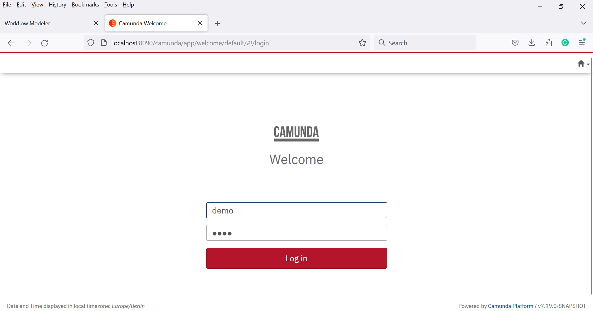

# ICSE 2025 Prototype

This use case folder comprises the following data:
* [Raw data of the runtime analysis](https://github.com/UST-QuAntiL/QuantME-UseCases/tree/master/2025-icse/evaluation-data)
* [Raw data of the user study](https://github.com/UST-QuAntiL/QuantME-UseCases/tree/master/2025-icse/user-study)
* [Quantum computing patterns with their corresponding categories](https://github.com/UST-QuAntiL/QuantME-UseCases/blob/master/2025-icse/PatternCategories.md)
* The description of the case study (see below)

# Case Study

Building quantum applications requires deep knowledge of quantum computing and software engineering.
Hence, an abstraction layer reducing the complexity for non-experts is required.
Patterns are an established concept for abstractly describing proven solution strategies to recurring problems.
Therefore, the quantum computing patterns, a pattern language for the quantum computing domain, can be used to define the building blocks and the structure of hybrid quantum applications.
Furthermore, concrete software artifacts can be associated with patterns to solve the corresponding problem.
However, these software artifacts are usually heterogeneous, e.g., using different data formats.
Quantum workflows enable a robust and scalable orchestration of these heterogeneous software artifacts.
However, manually modeling and configuring such quantum workflows is a complex, error-prone, and time-consuming task.
To overcome this issue, we present an approach that automates the generation and adaptation of quantum workflows utilizing the quantum computing patterns.

In the following sections, we showcase our pattern-based generation and adaptation approach for an exemplary variational quantum algorithm that solves the Maximum Cut (MaxCut) problem using the [Quantum Approximate Optimization Algorithm (QAOA)](https://arxiv.org/pdf/1411.4028.pdf).

A video showcasing the described use case is available on YouTube:

[](https://drive.google.com/file/d/1fCADQjUJbD8tyFiX_Giknkx7Tf8zTAiq/view?usp=sharing)

The use case utilizes the following components:

* [Quantum Workflow Modeler](https://github.com/PlanQK/workflow-modeler): A graphical BPMN modeler to define, transform, and deploy quantum workflows.
* [Quokka](https://github.com/UST-QuAntiL/Quokka): A microservice ecosystem enabling a service-based execution of quantum algorithms.
* [Camunda BPMN Engine](https://camunda.com/products/camunda-platform/bpmn-engine/): A state-of-the-art BPMN workflow engine used to execute quantum workflows after transforming them to native BPMN workflow models to avoid the need for extending the workflow engine.
* [Winery](https://github.com/OpenTOSCA/winery): Winery is a web-based environment to graphically model TOSCA-based deployment models, which can then be attached to activities of quantum workflows to enable their automated deployment in the target environment.
* [OpenTOSCA Container](https://github.com/OpenTOSCA/container): A TOSCA-compliant deployment system to deploy and manage applications or services.
* [Script Splitter](https://github.com/UST-QuAntiL/qc-script-splitter): A service for splitting monolithic quantum computing scripts into a loosely coupled quantum workflow.


## Setup


First, we will discuss the steps required to set up the different components.
All components are available via Docker.
Therefore, these components can be started using the Docker-Compose file available [here](./docker):

1. Update the [.env](./docker/.env) file with your settings:
* ``PUBLIC_HOSTNAME``: Enter the hostname/IP address of your Docker engine. Do *not* use ``localhost``.

2. Run the Docker-Compose file:
```
docker-compose pull
docker-compose up --build
```

3. Wait until all containers are up and running. This may take some minutes.

Open the Quantum Workflow Modeler using the following URL: [localhost:8080](http://localhost:8080)

Afterward, the following screen should be displayed:


The Quantum Workflow Modeler is pre-configured with the endpoints of the workflow engine and the QRM repository.
To check these settings, click on ``Configuration`` in the toolbar, opening the config pop-up:


Please verify that the different configuration properties are set to the following values.
Thereby, $IP has to be replaced with the IP-address of the Docker engine used for the setup described above:

* Under ``General``:
    * ``Camunda Engine Endpoint``: http://$IP:8090/engine-rest
* Under ``GitHub``:
    * ``QRM Repository User``: UST-QuAntiL
    * ``QRM Repository Name``: QuantME-UseCases
    * ``QRM Repository Path``: 2025-icse/qrms

    * ``GitHub Token``: $YOUR_GITHUB_API_TOKEN
    * ``GitHub Repository Owner``: $YOUR_GITHUB_USER_NAME
    * ``GitHub Repository Name``: $REPOSITORY_NAME_THAT_SHALL_BE_USED
    * ``GitHub Repository Path``: $FOLDERNAME_THAT_SHALL_BE_USED
* Under ``OpenTOSCA Plugin``:
    * ``OpenTOSCA Endpoint:``: http://$IP:1337/csars
    * ``Winery Endpoint:``: http://$IP:8093/winery


### Generating the Quantum Workflow utilizing Patterns

To generate a quantum workflow utilizing the quantum computing patterns click on ``Pattern`` and ``Open Pattern Selection``. 
Afterward, click on ``Select Patterns``.


Next, click on the blue ``+`` icon and then select the ``Quantum Approximate Optimization Algorithm``, ``Circuit Cutting``, ``Biased Initial State``, and ``Readout Error Mitigation``.


After confirming the pattern selection, an overview of the workflow generation is shown. 


Next, click on ``Done`` and then on ``Combine Solutions``. Now an overview of the generated workflows with the attached patterns should be shown.


The imported workflow starts of with a quantum circuit loading task that generates a parameterized QAOA circuit.
Afterward, the circuit is executed and subsequently evaluated by a result evaluation task.
Subsequently, the circuit parameters are optimized by a parameter optimization task for the next iteration of the quantum algorithm.
Once the optimization is converged, the result is returned to the user for analysis.

The selected enhancement patterns (Circuit Cutting, Biased Initial State, and Readout Error Mitigation) are attached to the subprocess containing the quantum algorithm.
To integrate the patterns into the workflow and transform all QuantME modeling constructs by standard-compliant BPMN modeling constructs, click on ``Transformation``.


To deploy the required services click on ``OpenTOSCA`` and then on ``Service Deployment``.


In the pop-up all services that must be deployed before execution are shown. Click on ``Upload CSARs`` to upload all deployment models to OpenTOSCA and subsequently provide your deployment details and credentials.


Finally, bind the services to the corresponding workflow.
Next, deploy the workflow by clicking the ``Deploy Workflow`` button.


Open the Camunda Engine using the following URL: [$IP:8090](http://$IP:8090)
Use ``demo`` as username and password to log in, which displays the following screen:



Click on the home icon in the top-right corner and select ``Cockpit`` to validate that the workflow was successfully uploaded.
Then, click on ``Processes`` on the top-left and select the workflow from the list.
This should show a graphical representation of the uploaded workflow:


To instantiate the workflow, click the home button on the top-right, then select ``Tasklist``.
Next, click on ``Start process`` on the top-right, select the name of the uploaded workflow, and provide the input parameters:


The UI displays a notification at the bottom-right that the workflow instance was successfully started.
Afterward, once more, click on the home icon on the top-right and select Cockpit.
Click on the Running Process Instance, select the started workflow, and then click on the workflow ID.
Now the workflow's token flow and the changing variables can be observed. To see the current state of the workflow instance refresh the page.

## Disclaimer of Warranty
Unless required by applicable law or agreed to in writing, Licensor provides the Work (and each Contributor provides its Contributions) on an "AS IS" BASIS, WITHOUT WARRANTIES OR CONDITIONS OF ANY KIND, either express or implied, including, without limitation, any warranties or conditions of TITLE, NON-INFRINGEMENT, MERCHANTABILITY, or FITNESS FOR A PARTICULAR PURPOSE. You are solely responsible for determining the appropriateness of using or redistributing the Work and assume any risks associated with Your exercise of permissions under this License.

## Haftungsausschluss
Dies ist ein Forschungsprototyp. Die Haftung für entgangenen Gewinn, Produktionsausfall, Betriebsunterbrechung, entgangene Nutzungen, Verlust von Daten und Informationen, Finanzierungsaufwendungen sowie sonstige Vermögens- und Folgeschäden ist, außer in Fällen von grober Fahrlässigkeit, Vorsatz und Personenschäden, ausgeschlossen.
