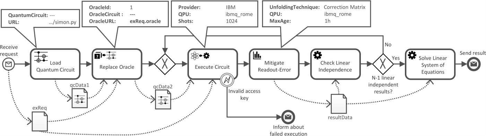
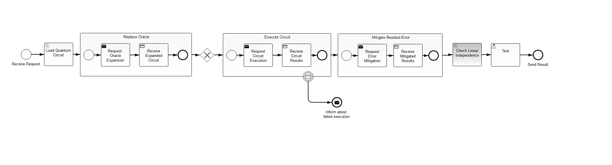

# QuantME-UseCase
This project represents a Camunda BPMN 2.0-based business process that executes Simon's algorithm to analyse the function passed to it by an implementing oracle.

The model presented here is a conversion of the following process model that uses the QuantME extension:



## BPMN 2.0-Compliant Model
The transformed BPMN 2.0 process model (in xml format) can be found [here](process-model/src/main/resources/simons-algorithm.bpmn).
The model can be visualized and edited using [bpmn.io](https://demo.bpmn.io/), or the [Camunda Modeler](https://camunda.com/download/).

A visualization of the transformed BPMN 2.0-compliant model is presented below:



## Deploying the Required Services

For the execution of the BPMN 2.0 process model, a set of services providing the required functionality for the different tasks needs to be deployed. These services are dockerized and located in [this folder](/services). Furthermore, the folder contains a docker-compose file, that can be used to easily set up all required service with the following command:

```
docker-compose up -d
```

In case you have not installed Docker or Docker-Compose, please refer to the following websites:
- [Docker](https://docs.docker.com/get-docker/)
- [Docker-Compose](https://docs.docker.com/compose/)

Otherwise, the services can also be set up manually. Please refer to the README files in the corresponding folders.

## Configuring the Process Model

A configuration file is used to specify the following values:

- The endpoint URL of the Oracle Replacement Service
- The endpoint URL of the Circuit Execution Service
- The endpoint URL of the Provenance Service
- TODO

This configuration file can be found [here](TODO).

## Building the Camunda Project

The project uses Java 8 and can be built and packaged using Maven. Please use the following command to built the WAR file:

```
mvn clean package
```

The project is packaged into a WAR file which can be found in the folloing path:

```
target/simons-algorithm-1.0-SNAPSHOT.war
```

This WAR file contains the process model as well as the used java classes and their dependencies.

## Deploying the Process Model

Follow these steps to deploy the process model to the Camunda engine:

1. Build and package the project into a WAR file (see above).

2. Install the standalone [Camunda Community Platform](https://camunda.com/download/) (please follow the instructions on this website).
We call the path where you unzipped the Camunda distribution _$CAMUNDA_HOME$_.

3. Camunda has an embedded Apache Tomcat server. Deploy the project you built in step 1 to this server by copying the WAR file
to the following folder:

```
$CAMUNDA_HOME$\server\apache-tomcat-XXX\webapps
```

You can now see the deployed process model in the various Camunda applications (Admin, Tasklist, and Cockpit): 
Go to [the Welcome application](http://localhost:8080/camunda/) and use "demo/demo" as a username and password. 

## Initiating the Process Model

TODO

## Disclaimer of Warranty

Unless required by applicable law or agreed to in writing, Licensor provides the Work (and each Contributor provides its Contributions) on an "AS IS" BASIS, WITHOUT WARRANTIES OR CONDITIONS OF ANY KIND, either express or implied, including, without limitation, any warranties or conditions of TITLE, NON-INFRINGEMENT, MERCHANTABILITY, or FITNESS FOR A PARTICULAR PURPOSE.
You are solely responsible for determining the appropriateness of using or redistributing the Work and assume any risks associated with Your exercise of permissions under this License.

## Haftungsausschluss

Dies ist ein Forschungsprototyp.
Die Haftung für entgangenen Gewinn, Produktionsausfall, Betriebsunterbrechung, entgangene Nutzungen, Verlust von Daten und Informationen, Finanzierungsaufwendungen sowie sonstige Vermögens- und Folgeschäden ist, außer in Fällen von grober Fahrlässigkeit, Vorsatz und Personenschäden, ausgeschlossen.
